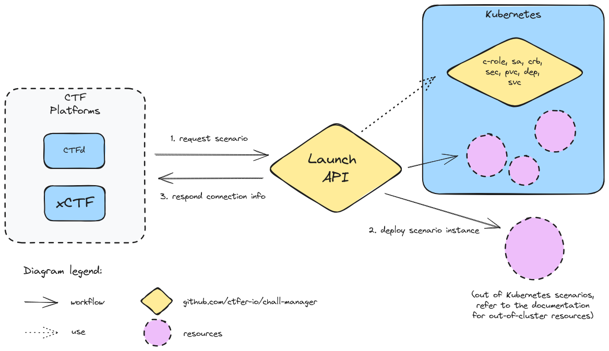
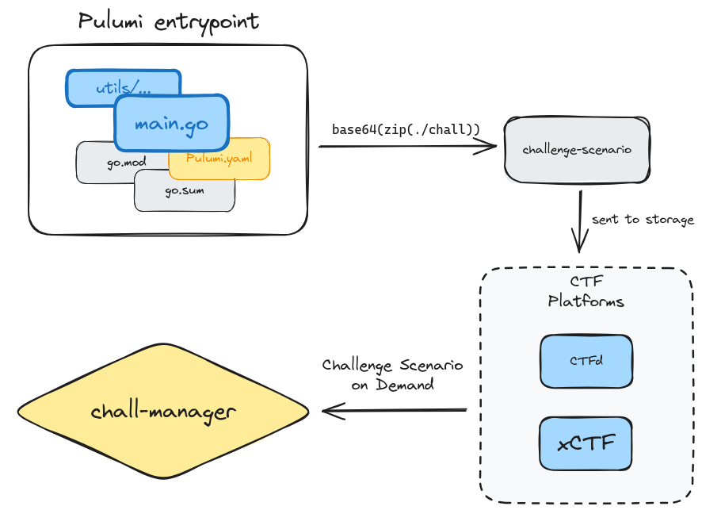

# Design Document

Table of content:
- [Context on existing limitations](#context-on-existing-limitations)
- [Our proposal](#our-proposal)
  - [Goal and perspectives](#goal-and-perspectives)
  - [Deployment](#deployment)
    - [Local deployment for developers](#local-deployment-for-developers)
	- [Production deployment](#production-deployment)
  - [SDK](#sdk)
- [Conclusion](#conclusion)

## Context on existing limitations

When designing a Capture The Flag event, you can come up with multiple challenge types: a single statement, some files to investigate, a binary to reverse, a filesystem dump, etc.
But those suffer from a design limitation: CTF platforms does not embody the concept of **scenarios**: infrastructures that are launched on demand and assigned to each player (or its team).

For instance, let's say you want to create a web pentest challenge that require the player to use a _nth-order_ attack. Most of the time you'll launch a Docker image containing this _scenario_, expose it in some way and provide this information to the players through the CTF platform of your choice, and then hope the players don't cope in other scopes which could be very hard and time-consuming for the challenge maker (denoted _ChallMaker_) to avoid. You want to focus on the actual value of your challenge, thus not on data consistency and integrity for the challenge to run properly and at scale. Furthermore, those design-specifics can stop you from successfully build the challenge you conceptualized.
The same concept could be illustrated through infrastructures pentest: you need to have a _challenge scenario_ for each player (or team of players). This could be illustrated by Active Directory attacks.
Most of the time, the organizers will stop there and will limit their CTF event to basic types (i.e. statements and files). Sometimes, challenges are pre-launched and linked are sent to the player (or its team) such that they could reach the deployed infrastructure.
One example is the recent challenge category "web3": there is one blockchain for everyone, leading the operators (denoted _Ops_) to reinitialize it frequently thus downtimes are necessary and perceived as poor organization by the players. This is exacerbated for CTF events that are short-living (a few hours) or for whose involving winning prizes based on your scoreboard rank, in which stress can lead to unpleasant comments or attitudes.

Here we observe that there exist a big limitation in the current way we build CTF events, and making it a reality is a challenge we need to overcome in order to revolutionize the CTF games and enhance the skills we are looking and training for.
The existing platforms may need to evolve deeply to adopt this new type of challenges, mostly from the technical point of view and the adoption of Infrastructure as Code as a cornerstone.

Nevertheless, the concept of automating the ignition of those _Challenge Scenario_ is not an innovation: for instance, CTFd, the most adopted CTF platform, has many plugins that aims to partially solve the issue by reusing the Docker socket from the host machine where the CTFd instance is hosted in order to issue OCI-compliant API calls to provide **Challenge Scenario on Demand**-like functionality.
Such strategy is limited to containers running locally, and with small capabilities of networking rules (no port reuse due to the absence of LoadBalancer), volume provisionning, deployment capabilities, and no capability to work at all in common cloud providers (GCP, AWS, etc.).
Even if this solves partially the problem of _Challenge Scenario on Demand_, those naive approaches does nothing for whole infrastructures: they need genericity in their approach while not separating the concerns and this overload to the CTF platform (for performances, _cleaner_ dependency graph i.e. needing only what is really necessary to fulfill its main goal, scalability, security profiles, etc.).
For instance, we may want to deploy a small-company IT system, use a technology like Ansible to configure the systems, generate good randoms that won't be hardcoded somewhere in the declarative files, or even start a virtual machine on an hypervisor. Those are not possible natively through containers on a host machine.

One more problem arise from the previous statements: they does not, or badly, scale.
Scalability is a priority for large events (the [BreizhCTF](https://www.breizhctf.com/) 2023 with around six hundreds on-premise players, the [DownUnderCTF](https://downunderctf.com/) 2023 with [more than two thousand teams](https://downunderctf.com/blog/2023/infra-writeup/#getting-into-the-groove) from all around the globe, etc.), so having a _Challenge Scenario on Demand_ capacity or a scalability is a trade-off you must not take, especially when bounded to your host machines and their respective capacities.
The proper solution to this issue is not by focusing on a balance between those two criteria, but by solving the two at the same time. Such approach would be generic in the way it thinks of infrastructures and scalability with a big focus on being cloud-native.

The following table gives context on the known CTF platforms and their limitations on the concept of _Challenge Scenario on Demand_. Classification follows.
Platforms were selected from the work of [Karagiannis _et al._ (2021)](https://dx.doi.org/10.1007/978-3-030-59291-2_5).

| Capture The Flag (CTF) platform | Challenge Scenario on Demand | Method | Scalable |
|:---:|:---:|:---:|:---:|
| [FBCTF](https://github.com/facebook/fbctf) |  |  |  |
| [CTFd](https://github.com/CTFd/CTFd) | ❔ | Docker socket¹ | ❌ |
| [Mellivora](https://github.com/Nakiami/mellivora) ||  |  |  |
| [Root The Box](https://github.com/moloch--/RootTheBox/) ||  |  |  |
| [kCTF](https://google.github.io/kctf/)|  |  |  |
| [rCTF](https://rctf.redpwn.net/) | ❔² | Kubernetes CRD | ✅ |

Classification for `Challenge Scenario on Demand`:
- ✅ native implementation
- ❔ extension is required, either official or community-backed
- ❌ not possible

Classification for `Scalable`:
- ✅ partially or completfully scalable
- ❌ only one instance is possible

**¹** Non exhaustive list of CTFd plugins that provide a _Challenge Scenario on Demand_-like capacity using the Docker (or any container technology) socket:
- https://github.com/frankli0324/ctfd-whale
**²** [Klodd](https://klodd.tjcsec.club/) is a Tjcsec effort to provide _Challenge Scenario on Demand_ functionality to rCTF through Kubernetes CRD, thus could be managed as cloud resources. This approach is limited first to Kubernetes resources, and second to the Klodd functionalities of its Kubernetes CRD. Nevertheless, it is platform-agnostic thus could be integrated with most CTF platforms.

## Our proposal

In response to the previous context and exposed limitations (observations and issues shared across the CTF organizers community), the CTFer.io organization comes up with the **chall-manager**.
This solution is **non vendor-locking**, built as a **Kubernetes-native μService** and according to the [12 Factor App methodology](https://12factor.net/) thus any CTF platform could integrate the concept of **Challenge Scenario on Demand** with no more than an API call, while being **scalable**.

In the following subsections, we explain what is our [goal and perspectives](#goal-and-perspectives), then discuss the [deployment](#deployment) of a chall-manager locally and in production, and then explain how to produce a _Pulumi entrypoint_ for a _Challenge Scenario_ with the [SDK](#sdk).

Despite what will be explained later, the following figure gives context on how it is integrated.

<div align="center">
    
</div>

### Goal and perspectives

The goal of the _chall-manager_ is to expose a [gRPC](https://grpc.io/) server that deploys [Pulumi](https://www.pulumi.com/) stacks on the fly i.e. a _Challenge Scenario on Demand_.
It is built by a Model-Based Engineering (denoted _MBE_) approach, especially by code-generation of the API models, client and server, from a [protobuf](https://protobuf.dev/) file. As protobuf is language-agnostic (or more likely has support for many languages), you could reuse this model to build the SDK that is needed in order to interoperate with a CTF platform. Notice the [chall-manager repository](https://github.com/ctfer-io/chall-manager) already contains the Go models, client and server.
Moreover, in order to ease interoperability and developer experience, or to support languages that does not fit within the protobuf scope, the _chall-manager_ could expose a [gRPC-gateway](https://grpc-ecosystem.github.io/grpc-gateway/) server i.e. a REST JSON API, along with a [swagger](https://swagger.io/) web page.
The details about the API won't be detailled here as it is already documented in the protobuf files and the swagger web page.

In parallel to those technical perspectives of being a server, once it received a _Launch Request_ asking for a _Challenge Scenario on Demand_ deployment, the _chall-manager_ brings the challenge and user (or its team) identifier altogether with a salt and generate an `identity`. This identity is a 32-chars string that should be trusted unique, which could be used to identity the _Challenge Scenario on Demand_, for instance as part of a DNS entry.
This information is then passed to the _scenario factory_ i.e. the Pulumi entrypoint as a configuration element, which is then in charge of deploying the desired challenge resources, and returning a `connection_info` string that will be passed to the player (or its team) for reaching the deployed resources (e.g. `curl -v https://a5d6...38cf.ctfer.io`).
More info on how to write this Pulumi entrypoint is available in the [SDK](#sdk) section.

<div align="center">
    
</div>

In the end, the _chall-manager_ make use of groud-breaking and modern technologies to solve long-living problems.
We trust this will impact the future CTF events with new unique capacities of _Challenge Scenario on Demand_, and as part of our overall work at the CTFer.io organization, will globally improve the technical perspectives of teaching, sharing, testing and recruiting cybersecurity (or any field applicable) enthusiasts.

### Deployment

When deploying resources to a Kubernetes cluster with the necessity of high availability and security, a beginner can only focus on getting the things work. We do not want that because in the design of the chall-manager itself, code is run from distant inputs we can't trust by default (no authentication is part of the chall-manager nor does we want to).
At the end of the day, if deployment is too complicated, this new technology won't be adopted.

In the next explanations, we will focus on the two following use cases. Most of readers would focus on [the second one](#production-deployment).
1. a [local deployment for developers](#local-deployment-for-developers), with a local rebuild of the Docker image
2. a [production deployment](#production-deployment)

#### Local deployment for developers

In this scenario, we consider you are a CTFer.io contributor or an integrator of the chall-manager.

On your host machine, you could rebuild the Docker image to make sure your contributions did not break the whole solution (for instance, before a PR), or to integrate the chall-manager into a CTF platform.

In the following code, we rebuild the docker image and then run it locally with the gRPC-gateway and the swagger turned on.
Additional tuning can be performed if necessary.

```bash
docker build -t ctfer-io/chall-manager:dirty -f Dockerfile.scratch .
docker run -p 8080:8080 -p 9090:9090 ctfer-io/chall-manager:dirty --gw --gw-swagger
```

With this deployment, you could call the gRPC server on `localhost:8080` and the gRPC-gateway thus the REST JSON API on `http://localhost:9090` and the swagger at `http://localhost:9090/swagger`.

Once done, you could stop the locally-built container and go on.

#### Production deployment

In this scenario, we consider you are a CTFer.io chall-manager dependent user looking for production deployment.

The requirements are a Kubernetes cluster up and running, with a CNI that could provide mTLS (for instance, the [service mesh of Cilium](https://cilium.io/use-cases/service-mesh/) which could be deployed using [ctfer-l3](https://github.com/ctfer-io/ctfer-l3)).

In an effort to bring Infrastructure as Code as most reusable as possible, we provide the Pulumi component `github.com/ctfer-io/chall-manager/deploy/components.*ChallManager`.
For most use cases, you could deploy it using the Pulumi CLI as follows.

```bash
cd deploy
pulumi stack init
> ...
pulumi up --yes
> ...
```

To reuse the Pulumi component, you can integrate the following Go code.

```go
import (
    "github.com/ctfer-io/chall-manager/deploy/components"
    "github.com/pulumi/pulumi/sdk/v3/go/pulumi"
)

// ...

func SomeFunc(ctx *pulumi.Context, opts ...pulumi.ResourceOption) error {
    // ...
    
    cm, err := components.NewChallManager(ctx, &components.ChallManagerArgs{
        Namespace:   pulumi.String("..."),
    }, opts...)
    if err != nil {
        return err
    }

    // ...
}
```

As part of this deployment, the builder function creates a `ClusterRole`, a `ServiceAccount` and the `ClusterRoleBinding` to match the two previous. By default, it provides enough permissions to deploy the resources creates in the [SDK](#sdk).
With enough privileges, it then deploy a namespace for the _Challenge Scenario on Demand_ to run into, the chall-manager `Deployment` with its `Pod` replicas and the `Service`.

Is you want to integrate it without the use of the Pulumi component, please refer to the code internals.
The reason here is to avoid maintainance and documentation deltas, as we test this component.

It separates the namespace the chall-manager is deployed into (which should be the same as the CTF platform instances) to the namespace the challenges are run into. This enable the networking policies to ensure the in-cluster resources that will be compromised won't enable players to pivot to the internal services.
Moreover, thanks to the [SDK](#sdk) the default behavior of created resources is to isolate themselves 

In case of emergency, an Ops can destroy the whole namespace. This will break the link between the chall-manager and its resources but will enable your cluster to stop permitting players to connect into the cluster.
Integrations should be aware of this scenario and handle that case to recover properly.
Such scenario is realistic as it could also happen through chaos enginerring practices.

### SDK

The SDK is a major functionality provided by the chall-manager.
By nature, as we recommend using the chall-manager as a Kubernetes-native μService, the SDK is aligned with this so is the API too.

It gives the Pulumi entrypoint inputs (especially the namespace to deploy resources into and the identity) and expect as output the connection information string (e.g. `curl -v https://a5d6...38cf.ctfer.io`).
The _identity_ is a 32-chars unique string that identifies the _Challenge Scenario on Demand_ resources. It could be used to create ingresses, be used as a random seed for secrets, etc.

When looking for deploying challenge with a single `Pod` replica as part of a `Deployment`, and then exposing it with a `Service`, isolating it with `NetworkPolicies` in an effort of security by design, etc. This could be a big overhead for the _ChallOps_ (the collaboration of the _ChallMaker_ and _Ops_ roles, either as one person denoted _ChallOps_ or multiple ones).
To avoid this, the Software Development Kit (denoted _SDK_) provided natively gives you access to standard deployment scenarios:
- _ExposedMonopod_: a single pod that need to be exposed, either with an `Ingress` or a `Service` typed `NodePort`. This fits most of the cases of crypto, pwn or web challenges. For additional information, please refer to their own documentation detailing their internals.

More than the standard deployment practices, the chall-manager ease the integration of the launch API: the inputs (Pulumi stack configuration) and outputs (Pulumi stack exported outputs) are not exposed directly but rather through a standard request/response schema.

For instance, the following Go sample shows you how to handle the inputs and outputs manually.

```go
package main

import (
	"github.com/pulumi/pulumi/sdk/v3/go/pulumi"
	"github.com/pulumi/pulumi/sdk/v3/go/pulumi/config"
)

func main() {
	pulumi.Run(func(ctx *pulumi.Context) error {
		// 1. Load config
		cfg := config.New(ctx, "no-sdk")
		config := map[string]string{
			"identity": cfg.Get("identity"),
		}

		// 2. Create resources
		// ...

		// 3. Export outputs
		ctx.Export("connection_info", pulumi.String("..."))
		return nil
	})
}
```

By using the SDK, you can simply do the following.
It highlights that you don't have to worry about the API changes from the _ChallOps_ perspective as we will make sure to handle it in the SDK, as a first-class functionality.

```go
package main

import (
	"github.com/ctfer-io/chall-manager/sdk"
	"github.com/pulumi/pulumi/sdk/v3/go/pulumi"
)

func main() {
	sdk.Run(func(req *sdk.Request, resp *sdk.Response, opts ...pulumi.ResourceOption) error {
		// Create resources
		// ...

		resp.ConnectionInfo = pulumi.String("...").ToStringOutput()
		return nil
	})
}
```

Despite we describe here a Kubernetes environment, you could also use the chall-manager to create external resources: Proxmox Virtual Machines, WordPress objects, etc.
You could even use the Pulumi SDK to interoperate with Ansible or custom scripts.
As those cases are trusted not common, there integration won't be discussed here and how to use an external secret provider to handle secrets (API keys, JWT, etc.).

## Conclusion

Thanks to our proposition, we solve long-living limitations of CTF events by generalizing the approach to handle resources of challenges that require infrastructures.
We provide a Kubernetes μService ready for production charges that leverages the Pulumi capabilities to make the dream of _Challenge Scenario on Demand_ a reality.
Moreover, this solution is not vendor-locking and the Model-Based Engineering strategy we adopted enables us to be language-agnostic with either a gRPC API or a REST JSON API.
Additionaly we created a SDK for common Kubernetes-based use cases, so we trust it could be adopted by CTF platforms and CTF organizers and their _Ops_.

Future work will imply public _Request For Comments_ around new generalizations of Kubernetes standard deployments, documentation around Kubernetes pentests and external resources. Moreover, we plan to create a CTFd plugin to integrate the chall-manager using the REST JSON API.
