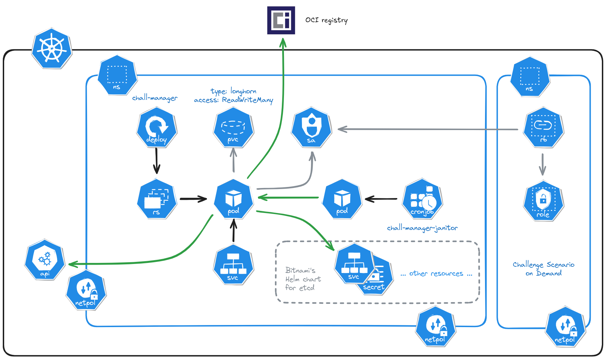

# Design Document

Table of content:
- [Context on existing limitations](#context-on-existing-limitations)
- [Our proposal](#our-proposal)
  - [Goal and perspectives](#goal-and-perspectives)
  - [Internals](#internals)
  - [High Availability](#high-availability)
  - [Timeouts](#timeouts)
  - [Security](#security)
	- [Authentication](#authentication)
	- [Shareflag](#shareflag)
  - [Deployment](#deployment)
    - [Local deployment for developers](#local-deployment-for-developers)
	- [Production deployment](#production-deployment)
  - [SDK](#sdk)
- [Conclusion](#conclusion)

## Context on existing limitations

When designing a Capture The Flag event, you can come up with multiple challenge types: a single statement, some files to investigate, a binary to reverse, a filesystem dump, etc.
But those suffer from a design limitation: CTF platforms does not embody the concept of **scenarios**: infrastructures that are launched on demand and assigned to each player (or its team).

For instance, let's say you want to create a web pentest challenge that require the player to use a _nth-order_ attack. Most of the time you'll launch a Docker image containing this _scenario_, expose it in some way and provide this information to the players through the CTF platform of your choice, and then hope the players don't cope in other scopes which could be very hard and time-consuming for the challenge maker (denoted _ChallMaker_) to avoid. You want to focus on the actual value of your challenge, thus not on data consistency and integrity for the challenge to run properly and at scale. Furthermore, those design-specifics can stop you from successfully build the challenge you conceptualized.
The same concept could be illustrated through infrastructures pentest: you need to have a _challenge scenario_ for each player (or team of players). This could be illustrated by Active Directory attacks.
Most of the time, the organizers will stop there and will limit their CTF event to basic types (i.e. statements and files). Sometimes, challenges are pre-launched and linked are sent to the player (or its team) such that they could reach the deployed infrastructure.
One example is the recent challenge category "web3": there is one blockchain for everyone, leading the operators (denoted _Ops_) to reinitialize it frequently thus downtimes are necessary and perceived as poor organization by the players. This is exacerbated for CTF events that are short-living (a few hours) or for whose involving winning prizes based on your scoreboard rank, in which stress can lead to unpleasant comments or attitudes.

Here we observe that there exist a big limitation in the current way we build CTF events, and making it a reality is a challenge we need to overcome in order to revolutionize the CTF games and enhance the skills we are looking and training for.
The existing platforms may need to evolve deeply to adopt this new type of challenges, mostly from the technical point of view and the adoption of Infrastructure as Code as a cornerstone.

Nevertheless, the concept of automating the ignition of those _Challenge Scenario_ is not an innovation: for instance, CTFd, the most adopted CTF platform, has many plugins that aims to partially solve the issue by reusing the Docker socket from the host machine where the CTFd instance is hosted in order to issue OCI-compliant API calls to provide **Challenge Scenario on Demand**-like functionality.
Such strategy is limited to containers running locally, and with small capabilities of networking rules (no port reuse due to the absence of LoadBalancer), volume provisionning, deployment capabilities, and no capability to work at all in common cloud providers (GCP, AWS, etc.).
Even if this solves partially the problem of _Challenge Scenario on Demand_, those naive approaches does nothing for whole infrastructures: they need genericity in their approach while not separating the concerns and this overload to the CTF platform (for performances, _cleaner_ dependency graph i.e. needing only what is really necessary to fulfill its main goal, scalability, security profiles, etc.).
For instance, we may want to deploy a small-company IT system, use a technology like Ansible to configure the systems, generate good randoms that won't be hardcoded somewhere in the declarative files, or even start a virtual machine on an hypervisor. Those are not possible natively through containers on a host machine.

One more problem arise from the previous statements: they does not, or badly, scale.
Scalability is a priority for large events (the [BreizhCTF](https://www.breizhctf.com/) 2023 with around six hundreds on-premise players, the [DownUnderCTF](https://downunderctf.com/) 2023 with [more than two thousand teams](https://downunderctf.com/blog/2023/infra-writeup/#getting-into-the-groove) from all around the globe, etc.), so having a _Challenge Scenario on Demand_ capacity or a scalability is a trade-off you must not take, especially when bounded to your host machines and their respective capacities.
The proper solution to this issue is not by focusing on a balance between those two criteria, but by solving the two at the same time. Such approach would be generic in the way it thinks of infrastructures and scalability with a big focus on being cloud-native.

The following table gives context on the known CTF platforms and their limitations on the concept of _Challenge Scenario on Demand_. Classification follows.
Platforms were selected from the work of [Karagiannis _et al._ (2021)](https://dx.doi.org/10.1007/978-3-030-59291-2_5).

| Capture The Flag (CTF) platform | Challenge Scenario on Demand | Method | Scalable |
|:---:|:---:|:---:|:---:|
| [FBCTF](https://github.com/facebook/fbctf) |  |  |  |
| [CTFd](https://github.com/CTFd/CTFd) | ❔ | Docker socket¹ | ❌ |
| [Mellivora](https://github.com/Nakiami/mellivora) ||  |  |  |
| [Root The Box](https://github.com/moloch--/RootTheBox/) ||  |  |  |
| [kCTF](https://google.github.io/kctf/)|  |  |  |
| [rCTF](https://rctf.redpwn.net/) | ❔ | Kubernetes CRD² | ✅ |

Classification for `Challenge Scenario on Demand`:
- ✅ native implementation
- ❔ extension is required, either official or community-backed
- ❌ not possible

Classification for `Scalable`:
- ✅ partially or completfully scalable
- ❌ only one instance is possible

**¹** Non exhaustive list of CTFd plugins that provide a _Challenge Scenario on Demand_-like capacity using the Docker (or any container technology) socket:
- https://github.com/frankli0324/ctfd-whale

**²** [Klodd](https://klodd.tjcsec.club/) is a Tjcsec effort to provide _Challenge Scenario on Demand_ functionality to rCTF through Kubernetes CRD, thus could be managed as cloud resources. This approach is limited first to Kubernetes resources, and second to the Klodd functionalities of its Kubernetes CRD. Nevertheless, it is platform-agnostic thus could be integrated with most CTF platforms.

## Our proposal

In response to the previous context and exposed limitations (observations and issues shared across the CTF organizers community), the CTFer.io organization comes up with the **chall-manager**.
This solution is **non vendor-locking**, built as a **Kubernetes-native μService** and according to the [12 Factor App methodology](https://12factor.net/) thus any CTF platform could integrate the concept of **Challenge Scenario on Demand** with no more than an API call, while being **scalable**.

In the following subsections, we explain what is our [goal and perspectives](#goal-and-perspectives), then discuss the [deployment](#deployment) of a chall-manager locally and in production, and then explain how to produce a _Pulumi entrypoint_ for a _Challenge Scenario_ with the [SDK](#sdk).

Despite what will be explained later, the following figure gives context on how it is integrated.

<div align="center">
    
</div>

### Goal and perspectives

The goal of the _chall-manager_ is to expose a [gRPC](https://grpc.io/) server that deploys [Pulumi](https://www.pulumi.com/) stacks on the fly i.e. a _Challenge Scenario on Demand_.
It is built by a Model-Based Systems Engineering (denoted _MBSE_) approach, especially by code-generation of the API models, client and server, from a [protobuf](https://protobuf.dev/) file. As protobuf is language-agnostic (or more likely has support for many languages), you could reuse this model to build the SDK that is needed in order to interoperate with a CTF platform. Notice the [chall-manager repository](https://github.com/ctfer-io/chall-manager) already contains the Go models, client and server.
Moreover, in order to ease interoperability and developer experience, or to support languages that does not fit within the protobuf scope, the _chall-manager_ could expose a [gRPC-gateway](https://grpc-ecosystem.github.io/grpc-gateway/) server i.e. a REST JSON API, along with a [swagger](https://swagger.io/) web page.
The details about the API won't be detailled here as it is already documented in the protobuf files and the swagger web page.

In parallel to those technical perspectives of being a server, once it received a _Launch Request_ asking for a _Challenge Scenario on Demand_ deployment, the _chall-manager_ brings the challenge and user (or its team) identifier altogether with a salt and generate an `identity`.
This information is then passed to the _scenario factory_ i.e. the Pulumi entrypoint as a configuration element, which is then in charge of deploying the desired challenge resources, and returning a `connection_info` string that will be passed to the player (or its team) for reaching the deployed resources (e.g. `curl -v https://a5d6...38cf.ctfer.io`).
More info on how to write this Pulumi entrypoint is available in the [SDK](#sdk) section.

<div align="center">
    
</div>

In the end, the _chall-manager_ make use of groud-breaking and modern technologies to solve long-living problems.
We trust this will impact the future CTF events with new unique capacities of _Challenge Scenario on Demand_, and as part of our overall work at the CTFer.io organization, will globally improve the technical perspectives of teaching, sharing, testing and recruiting cybersecurity (or any field applicable) enthusiasts.

### Internals

In this chapter, we will describe how the chall-manager works internally, in an open-source and disclosure effort.

First of all, as stated before, the chall-manager exposes a gRPC server by default and can also start a gRPC-gateway server that serves a REST JSON API which would transmit requests to the first. Using those APIs, it generates an identity and "launches" _Challenge Scenario on Demand_ i.e. it executes Pulumi code that creates resources. Once they are up and running, and any configuration has been performed, it returns the connectuin information on how to connect to the freshly-deployed resources in order to start the challenge.
This whole workflow is illustrated by the following figure.

<div align="center">
	
</div>

The **identity** is a 32-chars string that should be trusted unique, which could be used to identify the _Challenge Scenario on Demand_, for instance as part of a DNS entry. It could also be used as pseudo-random number generator (denoted _PRNG_) seed, to create a random flag value, etc.
Internally, the method is reproducible and depends on the chall-manager salt and the _Challenge Scenario on Demand_ request attributes (`challenge_id` and `source_id`). The salt is important to ensure players won't be able to guess the _identity_ based on their own identifiers thus reach other players infrastructures, with possible DoS/DDoS tentative. Moreover, it also serves as the _ChallOps_ can't build differrent or easier-to-solve infrastructures depending on who issued the request, as the identity includes a random they should not have access to.

This reproducible generation method is represented as follows.

<div align="center">
	
</div>

Being reproducible is necessary to ensure events reproducibility (in case of any infrastructure failure during an event) and avoid players to reconfigure their scripts and tools on every _Challenge Scenario on Demand_ request.
Moreover, it provides consistency between replicas behavior in case of a High-Availability deployment.

### High Availability

Previously, we exposed the chall-manager must reach high availability (denoted _HA_) to perform well at scale e.g. for large events.
In the current section we prove our design can do so.

First of all, for simplicity we wanted the chall-manager to be database-less (denoted _DB-less_).
To store the _Challenge Scenario_ stacks and their _Challenge Scenario on Demand_ states, we would need an object database as they are files, or something similar (e.g. storing states as strings in a relational database, storing the JSON state as a tabular content, etc.).
Our decision is to write them to the filesystem such that they could be easily stored, shared and replicated through a cluster or machines.
Those needs were solved by using [Longhorn](https://longhorn.io/) for a `PersistentVolumeClaim` that stores the states directory (configurable with the CLI flag `--states-dir`), with an access mode `ReadWriteMany`.

Storing is a thing, race condition is another: if an end-user spams the chall-manager with concurrent requests through the CTF platform, concurrent actions will be performed such as creating an infrastructure.
To avoid this, our design makes use of locks, using the distributed lock system of [the etcd concurrency API](https://etcd.io/docs/v3.2/dev-guide/api_concurrency_reference_v3/).
A first approach is to create an entry for the identity then lock it. In case of sudden failure, the lock will always be released: etcd will lose contact with the requesting `Pod` thus release the distributed lock, or the filelock will detect the release of the lock with the process being killed.
In the end, this schema enables us to make sure the chall-manager can scale properly while maintaining integrity of the underlying infrastructures.

However, this is not satifsying enough: sharing a mutual exclusion for all read and write operations is like a tank to kill a fly, overkill.
When the chall-manager is only requested to read content, it should not stop concurrent calls to starve. To avoid this, the community proposed a solution a long time ago at the beginning of reflexions on operating systems in response to the **readers-writer problem**.
Many solutions have been proposed, with preference variations (either readers or writer should have the priority, leases or heartbeats for fault-tolerance, FIFO for writers ordering, etc.). In our case, we can consider the write operations infinitely longer that the read ones, and in the event of a request to get state content, we want it updated to the latest situation i.e. a writer-preference.
Naturally, this falls to the readers-writer problem with writer-preference: CUD operations will have priority over the R operations.
Technically, we implement the Courtois et al. (1971) 2nd solution to this problem.

Last but not least, we also want to implement a `Query` method retrieving the whole states informations in parallel and as soon as possible (e.g. for building administration dashboard of current _Challenge Scenario on Demand_). This imply we need to stop all incoming CRUD operations to take a "snapshot" of the states, and falls too in the readers-writer problem with writer-preference. The same solution is implemented and denoted as "Top-Of-The-World lock" (aka "TOTW lock"), used with `Query` being a writer and CRUD operations readers.
To avoid over-starving incoming CRUD operations, the TOTW lock is first acquired, then the identity-specific lock is acquired, and once all identities are locked the TOTW lock is released to let CRUD operations perform as soon as possible. The identity-specific lock is released once state is sent.
Without such mecanism, the TOTW lock would hold until all states metadata are sent, so the unavailability of chall-manager would be of the longest TOTW hold thus the longest currently working CUD operation, which could be pretty long (let say 5 minutes for a μServices architecture).
We describe this as a "RWLock double chain", represented by the following figure.

<div align="center">
	
</div>

In our design, we deploy an etcd instance rather than using the Kubernetes already existing one. By doing so, we avoid deep integration of our proposal into the cluster which enables multiple instances to run in parallel inside an already existing cluster. Additionnaly, it avoids innapropriate service intimacy and shared persistence issues described as good development practices in μServices architectures by Taibi et al. (2020) and Bogard (2017).
Nevertheless, as etcd could be used a simplistic database our design could be proven non-DB-less, but does not imply limitations: we only use the etcd cluster for its distributed lock system and KVs, which is not necessary for the good work of the chall-manager but rather to ensure data consistency. This last could occur when updating rapidly the _Challenge Scenario_, which is not realistic.

Moreover, thanks to this design, we provide interoperability with additional systems that can easily integrate the distributed locks/KVs and shared volumes. Despite this, we think interesting designs that would do such integrations should discuss it to improve the chall-manager directly.

### Timeouts

Running a _Challenge Scenario on Demand_ is not transparent: it costs resources, time, and sometimes adds on top of an already large bill by the end of the event. In the [SDK](#sdk) chapter we explain how much it costs to properly expose a single pod and isolate it, showing this is a major topic for the persons in charge of sizing the infrastructure. Indeed, they will need to size the backend machines to fit a whole event and enough room to ensure it does not run out of resources at an inopportune moment, which could be technically complicated or impossible due to budget restrictions.

As a matter of fact, we don't need to run the _Challenge Scenario on Demand_ for the whole time of the event, even if it is under a day long: people won't use all the time those resources, will change focus and solve challenges. For instance, if we imagine an event with twenty teams of four people, 60 challenges with 12 feating the _Challenge Scenario on Demand_ feature, the team won't need to have all challenges up and running thus we may decrease the costs by a factor 2 to 3 which changes a lot the sizing of the infrastructure.
After some time (or if the challenge is flagged), we may want to get back our resources to use them elsewhere: we have to put a timeout on those resources such that they are not lost.
According to unstructured discussions with many players and organizers, we decided this feature has to be part of our solution to properly address the concerns and needs of the community.

In our design, we implement the timeout of a _Challenge Scenario on Demand_ with two attributes in the `LaunchRequest` object: `timeout` to define how long does it has to run, and `until` the date before which it has to run. You can either specify one of them or none to avoid this time-based feature to activate.
In case the `timeout` is used, we internally compute the date it would reach such that we only deal with a datetime. This one is stored as part of the state metadata in the shared volume.

In parallel, we decided to not implement a cleaning job as the chall-manager native features, as its goal is already clear: listen on API calls to make CRUD operations on _Challenge Scenario on Demand_. In this way, we created a second μService called `chall-manager-janitor` consisting of a simple Go binary that travels through the states folder and destroy them if passed their `until` datetime. It runs on a regular basis and is implemented as a Kubernetes `CronJob`.
The janitor integrates the distributed lock system of [etcd](https://etcd.io/) (or flock for local mode) to ensure data consistency i.e. avoid deleting resources in parallel of a renewal, in case this ever happen. Moreover, it reuses the service account of the `chall-manager` to ensure having the same permissions has it mostly consist of what `DeleteLaunch` performs.
Thanks to this, we enable the _Ops_ to configure how long does they think the resources should be alive for each challenge in their CTF platforms (depending on the available integrations and our features they support). Our design can be extended by the CTF platforms themselves with quota restrictions we don"t think should be part of our current solution.

Nevertheless, people may want to get their resources to run longer than what has been defined by the _Ops_ (difficulties to solve, too short timeouts, etc.). To incorporate this need in our design we added the support of the `timeout` and `until` attributes described above such that people can ask to renew their resources lifetime. Internally, this overwrite the existing state's metadata `until` attribute.

In the end, our proposal gets another interesting feature by design that is configurable to the _Ops_ and in favor of both the _Ops_ and players.

### Security

#### Authentication

By nature, the chall-manager has not been designed to perform authentication (thus authorization): it should not be exposed to end-users directly.
This copes with the 1st Unix philosophy.

> Make each program do one thing well. To do a new job, build afresh rather than complicate old programs by adding new "features".

Even is this is understandable, we also want people to do Defense in Depth.
For this reason, CTFer.io designed its production deployment of the chall-manager to use mTLS between its CTF platform instances and the chall-manager instances.
Technically, this is performed through the use of step-ca, cert-manager and cilium.

We recommend Ops that would like to do Defense in Depth to do similarly.
Please remember that in all cases, your chall-manager instances should not be reachable by the end-users.

#### Shareflag

An obstacle to a good event is cheating. People's interest may tend to this when focused on winning rather than learning or having a good time.
In this approach, they may lure or deal with other participants to share a flag to solve a challenge.

A good solution to avoid that behavior is by having a unique flag per team, but this imply a lot of work for the _ChallMaker_ to build and debug the challenge, and a long time adding them all in the CTF platform for the _Ops_. Moreover, this does not scale: horizontally by increasing the number of teams and/or players, vertically by increasing the number of challenges.
For instance, a reverse engineering themed challenge would imply to the _ChallMaker_ to either compile one binary that contains all those flags and hope everyone successfully falls into the its specific Call Graph Tree to find its flag, either compile _n_ binaries with the flag updated.
In the end, this approach is very limited, costfull, and operationally most likely not used.

In our proposal, as we already provide a solution to _Challenge Scenario on Demand_, we think we have to go further and make use of this design to enable automating it.
Indeed, once a challenge scenario request is performed, the factory can randomise a hardcoded flag value using the identity as a seed to a PRNG and provide it to the resources that is suppose to expose it. The flag variation algorithm walks on each character, if it is contained in a list of variations it randomly select one of its variations (could be itself), and then mutate it. This list of mutations has been manually built over the printable extended ascii table thus should be acceptable per each CTF platform. Variations are supposed to represent the same character (e.g. `e` could mutate to `€`, `È` or `3`).

Technically, this flag is returned by the Pulumi factory (_Challenge Scenario_) as an exported output throuh the key `flag`, as a string, and is non-mandatory. If provided, the CTF platform could add it on the fly to the list of acceptable flags for the challenge, or reuse a pivot structure between the team (or user) and the challenge, side to the connection information. If not provided, the CTF platform should only validate the flags of its Challenge resource.
Integration won't be further discussed as it is platform-specific and is trusted out of scope.

Through this design, we use a reproducible identity as a seed for a pseudo-random number generator, always perform the same simple operation, hence provide a reproducible way of randomising a flag per user (or team).

In addition to the contribution on generalizing the _Challenge Scenario on Demand_ problem, we integrate an anti-cheat (shareflag) protection by design.
Nevertheless, this approach is not sufficient to block people from sharing hints or writeups, but could build upon our current work at generalizing the approach to _Challenge Scenario on Demand_ in another work. We invite anyone interested to make a proposal and contribution in this way.

### Deployment

When deploying resources to a Kubernetes cluster with the necessity of high availability and security, a beginner can only focus on getting the things work. We do not want that because in the design of the chall-manager itself, code is run from distant inputs we can't trust by default (no authentication is part of the chall-manager nor does we want to).
At the end of the day, if deployment is too complicated, this new technology won't be adopted.

In the next explanations, we will focus on the two following use cases. Most of readers would focus on [the second one](#production-deployment).
1. a [local deployment for developers](#local-deployment-for-developers), with a local rebuild of the Docker image
2. a [production deployment](#production-deployment)

#### Local deployment for developers

In this scenario, we consider you are a CTFer.io contributor or an integrator of the chall-manager.

On your host machine, you could rebuild the Docker image to make sure your contributions did not break the whole solution (for instance, before a PR), or to integrate the chall-manager into a CTF platform.

In the following code, we rebuild the docker image and then run it locally with the gRPC-gateway and the swagger turned on.
Additional tuning can be performed if necessary.

```bash
docker build -t ctferio/chall-manager:dirty -f Dockerfile.scratch .
docker run -p 8080:8080 -p 9090:9090 ctferio/chall-manager:dirty --gw --gw-swagger
```

With this deployment, you could call the gRPC server on `localhost:8080` and the gRPC-gateway thus the REST JSON API on `http://localhost:9090` and the swagger at `http://localhost:9090/swagger`.

Once done, you could stop the locally-built container and go on.

#### Production deployment

In this scenario, we consider you are a CTFer.io chall-manager dependent user looking for production deployment.

The requirements are a Kubernetes cluster up and running, with a CNI that could provide mTLS (for instance, the [service mesh of Cilium](https://cilium.io/use-cases/service-mesh/) which could be deployed using [ctfer-l3](https://github.com/ctfer-io/ctfer-l3)).

In an effort to bring Infrastructure as Code as most reusable as possible, we provide the Pulumi component `github.com/ctfer-io/chall-manager/deploy/components.*ChallManager`.
For most use cases, you could deploy it using the Pulumi CLI as follows.

```bash
cd deploy
pulumi stack init
> ...
pulumi up --yes
> ...
```

To reuse the Pulumi component, you can integrate the following Go code.

```go
import (
    "github.com/ctfer-io/chall-manager/deploy/components"
    "github.com/pulumi/pulumi/sdk/v3/go/pulumi"
)

// ...

func SomeFunc(ctx *pulumi.Context, opts ...pulumi.ResourceOption) error {
    // ...
    
    cm, err := components.NewChallManager(ctx, &components.ChallManagerArgs{
        Namespace:   pulumi.String("..."),
    }, opts...)
    if err != nil {
        return err
    }

    // ...
}
```

As part of this deployment, the builder function creates a `ClusterRole`, a `ServiceAccount` and the `ClusterRoleBinding` to match the two previous. By default, it provides enough permissions to deploy the resources creates in the [SDK](#sdk).
With enough privileges, it then deploy a namespace for the _Challenge Scenario on Demand_ to run into, the chall-manager `Deployment` with its `Pod` replicas and the `Service`.

Is you want to integrate it without the use of the Pulumi component, please refer to the code internals.
The reason here is to avoid maintainance and documentation deltas, as we test this component.

It separates the namespace the chall-manager is deployed into (which should be the same as the CTF platform instances) to the namespace the challenges are run into. This enable the networking policies to ensure the in-cluster resources that will be compromised won't enable players to pivot to the internal services.
Moreover, thanks to the [SDK](#sdk) the default behavior of created resources is to isolate themselves 

The following figure shows the Kubernetes infrastructure that will be deployed. The ontology is the one defined by Kubernetes.

<div align="center">
	
</div>

In case of emergency, an Ops can destroy the whole namespace. This will break the link between the chall-manager and its resources but will enable your cluster to stop permitting players to connect into the cluster.
Integrations should be aware of this scenario and handle that case to recover properly.
Such scenario is realistic as it could also happen through chaos enginerring practices.

Finally, we would like to warn the integrators and administrators that would like to use the chall-manager: let's have _n_ sources (either user or team depending on the CTF mode) and _m_ challenges that require the creation of resources. At most (worst case) the CTF event will have to boot up to _n*m_ _Challenge Scenario on Demand_. The number of resources that need to be created will grow at a the same factor _n*m_.
For instance, the DUCTF2023 handled two thousands teams, and if we imagine there would have been 3 _Challenge Scenario on Demand_ typed challenge that makes use of the [SDK](#sdk) _ExposedMonopod_ builder, they could have created 6 thousands pods, 6 thousands services, 6 thousands ingresses, etc.
Please make sure your infrastructure can handle such a load, in case the worst case become a reality. Elseway, players can set down the infrastructure through involuntary DoS/DDoS. Furthermore, if you are running into a cloud provider (GCP, AWS, etc.) there should be major bills by the end of your event.
In case an integrator wants to avoid that, you could implement rate limiting, either with a total number of _Challenge Scenario on Demand_ running at the same time (may not be appreciated by the players who don't have any running instance to work on) or a quota per source like _n_ _Challenge Scenario on Demand_ requests for the whole event, with or without time limit.

### SDK

The SDK is a major functionality provided by the chall-manager.
By nature, as we recommend using the chall-manager as a Kubernetes-native μService, the SDK is aligned with this so is the API too.

It gives the Pulumi entrypoint inputs (especially the namespace to deploy resources into and the _identity_) and expect as output the connection information string (e.g. `curl -v https://a5d6...38cf.ctfer.io`).

When looking for deploying challenge with a single `Pod` replica as part of a `Deployment`, and then exposing it with a `Service`, isolating it with `NetworkPolicies` in an effort of security by design, etc. This could be a big overhead for the _ChallOps_ (the collaboration of the _ChallMaker_ and _Ops_ roles, either as one person denoted _ChallOps_ or multiple ones).
To avoid this, the Software Development Kit (denoted _SDK_) provided natively gives you access to standard deployment scenarios:
- _ExposedMonopod_: a single pod that need to be exposed, either with an `Ingress` or a `Service` typed `NodePort`. This fits most of the cases of crypto, pwn or web challenges. For additional information, please refer to their own documentation detailing their internals.

More than the standard deployment practices, the chall-manager ease the integration of the launch API: the inputs (Pulumi stack configuration) and outputs (Pulumi stack exported outputs) are not exposed directly but rather through a standard request/response schema.

For instance, the following Go sample shows you how to handle the inputs and outputs manually.

```go
package main

import (
	"github.com/pulumi/pulumi/sdk/v3/go/pulumi"
	"github.com/pulumi/pulumi/sdk/v3/go/pulumi/config"
)

func main() {
	pulumi.Run(func(ctx *pulumi.Context) error {
		// 1. Load config
		cfg := config.New(ctx, "no-sdk")
		config := map[string]string{
			"identity": cfg.Get("identity"),
		}

		// 2. Create resources
		// ...

		// 3. Export outputs
		ctx.Export("connection_info", pulumi.String("..."))
		return nil
	})
}
```

By using the SDK, you can simply do the following.
It highlights that you don't have to worry about the API changes from the _ChallOps_ perspective as we will make sure to handle it in the SDK, as a first-class functionality.

```go
package main

import (
	"github.com/ctfer-io/chall-manager/sdk"
	"github.com/pulumi/pulumi/sdk/v3/go/pulumi"
)

func main() {
	sdk.Run(func(req *sdk.Request, resp *sdk.Response, opts ...pulumi.ResourceOption) error {
		// Create resources
		// ...

		resp.ConnectionInfo = pulumi.String("...").ToStringOutput()
		return nil
	})
}
```

Despite we describe here a Kubernetes environment, you could also use the chall-manager to create external resources: Proxmox Virtual Machines, WordPress objects, etc.
You could even use the Pulumi SDK to interoperate with Ansible or custom scripts.
As those cases are trusted not common, there integration won't be discussed here and how to use an external secret provider to handle secrets (API keys, JWT, etc.).

In case you want to reuse the SDK not for _Challenge Scenario on Demand_ but for the ease of management, make sure your integration of the _chall-manager_ in your CTF platform can send a source identifier that is out of the possible generated ones (for instance `0` in case of non-zero autoincremental values, or `global` for GUIDs).
At the beginning of your CTF event, someone will launch the challenge infrastructure which will identify the source as something non-existing. The reproducible build of the _identity_ value described in the [internals](#internals) will provide informations that it is either non-running hence will start it, either is already running, then displays the connection informations. In the end, every source (team or user) works on the same instance which reduces the cost of deployment by a factor _n_ (the number of sources).

## Conclusion

Thanks to our proposition, we solve long-living limitations of CTF events by generalizing the approach to handle resources of challenges that require infrastructures.
We provide a Kubernetes μService ready for production charges that leverages the Pulumi capabilities to make the dream of _Challenge Scenario on Demand_ a reality.
Moreover, this solution is not vendor-locking and the Model-Based Engineering strategy we adopted enables us to be language-agnostic with either a gRPC API or a REST JSON API.
Additionaly we created a SDK for common Kubernetes-based use cases, so we trust it could be adopted by CTF platforms and CTF organizers and their _Ops_.

The current known limitations are on the supported software development languages: Pulumi support various language, but a finite set. Out of them, it is not possible to use the chall-manager to request _Challenge Scenario on Demand_. This limitation is leveraged by the use of a SDK that guides a lot ChallOps beginners in their operations.

Future work will imply public _Request For Comments_ around new generalizations of Kubernetes standard deployments in the SDK, documentation around the support of Kubernetes pentests and external resources. Moreover, we plan to create a CTFd plugin to integrate the chall-manager using the REST JSON API provided by the gRPC gateway.
