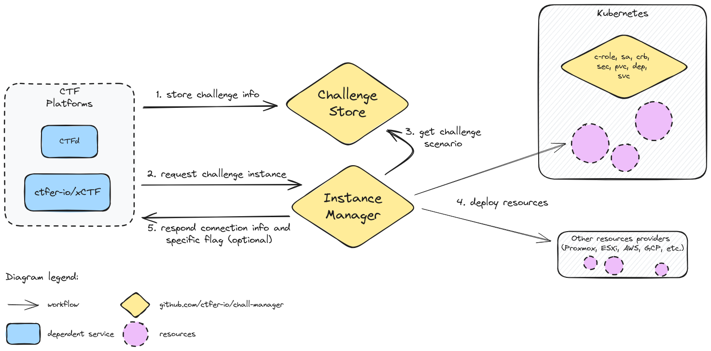

<div align="center">
    <h1>Chall-Manager</h1>
    <p><b>Challenge Scenarios on Demand, anywhere, anytime, of any size, and for anyone </b><p>
    <a href="https://pkg.go.dev/github.com/ctfer-io/chall-manager"></a>
    <a href="https://hub.docker.com/r/ctferio/chall-manager"></a>
	<a href="https://goreportcard.com/report/github.com/ctfer-io/chall-manager"></a>
	<a href="https://coveralls.io/github/ctfer-io/chall-manager?branch=main"></a>
	<br>
	<a href=""></a>
	<a href="https://github.com/ctfer-io/chall-manager/actions?query=workflow%3Aci+"></a>
	<a href="https://github.com/ctfer-io/chall-manager/actions/workflows/codeql-analysis.yaml"></a>
    <br>
    <a href="https://securityscorecards.dev/viewer/?uri=github.com/ctfer-io/chall-manager"></a>
</div>

> [!CAUTION]
> Chall-Manager is currently in public beta phase.
> It could be run in production, but breaking changes are subject to happen in the upcoming months until General Availability.

- [What ?](#what-)
- [Why ?](#why-)
- [Trophy list](#trophy-list)
- [Development setup](#development-setup)

## What ?

Chall-Manager is a **platform-agnostic** system able to **start Challenges on Demand** of a player: an **Instance**.
It **abstracts the deployment** thus is **able to cover all existing and future** systems with an API and CRUD operations on a resource: Kubernetes Pods, Proxmox VMs, AWS IAM, FPGA, ... at the only cost of a [Pulumi provider](https://www.pulumi.com/registry/).
To **avoid resources overconsumption**, it janitors them once expired.

To ease deployments, we created _"recipes"_ in a [SDK](sdk/).

Please [**Read the documentation**](https://ctfer.io/docs/chall-manager/) for better understanding.

<div align="center">
    
</div>

## Why ?

Alternatives exist, but were not sufficient: they focused on **a single technology** (e.g. Docker or Kubernetes only) and for **one specific platform**.

With Chall-Manager, you are now able to abstract this all thus don't require to follow other's technical choices.

## Trophy list

The following list contains all known events were Chall-Manager has been operated in production (YYYY/MM/DD):

- 2024/11/20 [NoBracketsCTF 2024](https://github.com/nobrackets-ctf/NoBrackets-2024)
- 2025/02/09 [ICAISC 2025](https://www.linkedin.com/feed/update/urn:li:ugcPost:7295762712364544001/?actorCompanyId=103798607)
- 2025/03/08 Hack'lantique 2025
- 2025/05/17 [WhiteHats TrojanCTF 2025](https://github.com/ESHA-Trojan/TrojanCTF-2025-public)
- 2025/05/24 [24h IUT 2025](https://www.linkedin.com/feed/update/urn:li:activity:7332827877123506177/)

Please [open an issue](https://github.com/ctfer-io/chall-manager/issues/new) to add your event to the list if we did not ourself.

## Development setup

Once you clonned the repository, run the following commands to make sure you have all the generated files on your local system and up to date.

```bash
make buf
make update-swagger
```

You could also run those before a commit that affects the `*.proto` files to avoid inconsistencies between your local setup and the distant branch.

If you need to run a local etcd instance, you could use the following.

```bash
docker run -v /usr/share/ca-certificates/:/etc/ssl/certs -p 4001:4001 -p 2380:2380 -p 2379:2379 -e ETCD_ROOT_PASSWORD=root bitnami/etcd:3.5.13
```
