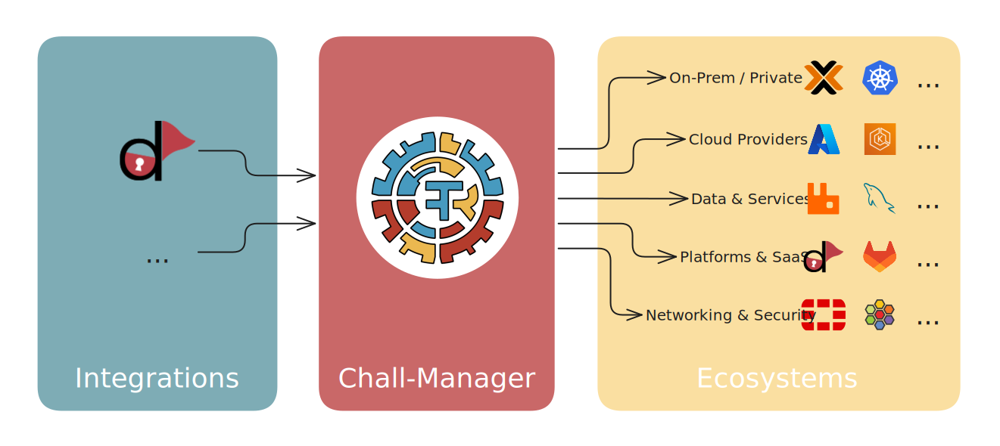

<div align="center">
    <h1>Chall-Manager</h1>
    <p><b>Finally, a proper solution for Challenges on Demand</b><p>
    <a href="https://ctfer.io/docs/chall-manager"></a>
    <a href=""></a>
    <a href="https://pkg.go.dev/github.com/ctfer-io/chall-manager"></a>
    <br>
	<a href="https://goreportcard.com/report/github.com/ctfer-io/chall-manager"></a>
    <a href="https://coveralls.io/github/ctfer-io/chall-manager?branch=main"></a>
	<a href="https://hub.docker.com/r/ctferio/chall-manager"></a>
	<br>
	<a href="https://github.com/ctfer-io/chall-manager/actions?query=workflow%3Aci+"></a>
	<a href="https://github.com/ctfer-io/chall-manager/actions/workflows/codeql-analysis.yaml"></a>
    <a href="https://securityscorecards.dev/viewer/?uri=github.com/ctfer-io/chall-manager"></a>
</div>

<div align="center">
    
</div>

Chall-Manager is a challenge instances on demand engine, designed to make managing CTF (Capture The Flag) challenges effortless.

Instead of juggling infrastructure details, container lifecycles, and scaling logic, Chall-Manager provides a unified abstraction layer to run and manage challenges reliably—whether for a classroom, training environment, or large-scale competition.

> [!CAUTION]
> Chall-Manager is currently in public beta phase.
> It could be run in production, but breaking changes are subject to happen in the upcoming months until General Availability.

## 🚀 What Chall-Manager Does

- **Abstracts infrastructure** – Run challenges locally, in Kubernetes, or across clouds without changing your workflows;
- **Manages challenge lifecycles** – Create, start, stop, and clean up instances on demand;
- **Scales intelligently** – Define minimum/maximum pool sizes, then automatically maintains the pool; pick from the pool whenever needed;
- **[Integrates with CTFd](https://github.com/ctfer-io/ctfd-chall-manager) and more** – Is platform-agnostic, and has [Terraform](https://github.com/ctfer-io/terraform-provider-ctfdcm) and [Pulumi](https://github.com/ctfer-io/pulumi-ctfdcm) integrations for [CTFd](https://github.com/ctfd/ctfd);
- **Provides a [SDK](/sdk)** – Build or reuse previous work, with the best trade-offs between capabilities, security by design and by default, and costs.

Whether you're running a single practice challenge or hundreds of dynamic containers, Chall-Manager takes care of the heavy lifting so you can focus on content and players.

## 🧩 Why Use Chall-Manager?

- **For Educators & Trainers** – Run reproducible lab environments for students without dealing with manual resets;
- **For CTF Organizers** – Handle thousands of ephemeral challenge instances with minimal ops overhead;
- **For Researchers & Developers** – Use the abstraction layer to prototype new challenge backends or integrations.

Chall-Manager turns complex infrastructure problems into simple challenge management.

## 📦 Installation

As a generic solution, many alternatives exist regarding deployment: please have a look [here](https://ctfer.io/docs/chall-manager/ops-guides/deployment/).

## ⚡ Quick Start

Let's spin a quick Docker infra, then deploy one example !

```bash
# Start the infra
docker network create quickstart || true
docker run -d --network quickstart --name registry      -p 5000:5000 registry:3
docker run -d --network quickstart --name chall-manager -p 8080:8080 ctferio/chall-manager:latest --oci.insecure

# Compile chall-manager-cli
#   go build -o chall-manager-cli cmd/chall-manager-cli/main.go
#   mv chall-manager-cli "$(go env GOPATH)/bin/"
#
# Alternatively you could install it using
#   go install github.com/ctfer-io/chall-manager/cmd/chall-manager-cli@latest
#
# Or you can execute it on the fly using "go run cmd/chall-manager-cli/main.go"
# instead of "chall-manager-cli" in the next steps.

# Create a challenge
chall-manager-cli --url localhost:8080 challenge create \
    --id test \
    --scenario registry:5000/your-org/your-scenario:v0.1.0 \
    --dir examples/additional \
    --insecure

# Then create an instance
chall-manager-cli --url localhost:8080 instance create \
    --challenge_id test \
    --source_id test

# Optional: wipe out all Docker setup
docker stop registry chall-manager
docker rm registry chall-manager
docker network rm quickstart
```

This example does not actually deploy resources, you'll have to provide Chall-Manager additional capabilities to do so !
Look at the [tutorials](https://ctfer.io/docs/chall-manager/tutorials/) for what fits your use case.

## 🏆 Trophy list

The following list contains all known public events where Chall-Manager has been operated in production (YYYY/MM/DD):

- 2024/11/20 [NoBracketsCTF 2024](https://github.com/nobrackets-ctf/NoBrackets-2024)
- 2025/02/09 [ICAISC 2025](https://www.linkedin.com/feed/update/urn:li:ugcPost:7295762712364544001/?actorCompanyId=103798607)
- 2025/03/08 Hack'lantique 2025
- 2025/05/17 [WhiteHats TrojanCTF 2025](https://github.com/ESHA-Trojan/TrojanCTF-2025-public)
- 2025/05/24 [24h IUT 2025](https://www.linkedin.com/feed/update/urn:li:activity:7332827877123506177/)
- 2025/11/29 [GreHack25](https://www.linkedin.com/posts/grehack_grehack25-activity-7401272551294787584-8ULF)

Please [open an issue](https://github.com/ctfer-io/chall-manager/issues/new) to add your event to the list if we did not ourself.

## 🔨 Development setup

Once you clonned the repository, run the following commands to make sure you have all the generated files on your local system and up to date.

```bash
make buf
make update-swagger
```

You could also run those before a commit that affects the `*.proto` files to avoid inconsistencies between your local setup and the distant branch.

If you need to run a local etcd instance, you could use the following.

```bash
docker run -v /usr/share/ca-certificates/:/etc/ssl/certs -p 4001:4001 -p 2380:2380 -p 2379:2379 -e ETCD_ROOT_PASSWORD=root bitnamilegacy/etcd:3.5.13
```
