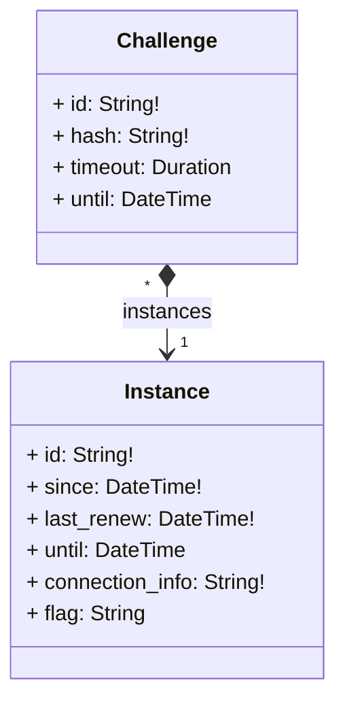

In the process of architecting a microservice, a first thing is to design the API exposed to the other microservices.
Once this done, you implement it, write the underlying software that provides the service, and think of its deployment architecture to fulfill the goals.

## API

We decided to avoid API conception issues by using a [Model Based Systems Engineering](https://en.wikipedia.org/wiki/Model-based_systems_engineering) method, to focus on the service to provide. This imply less maintenance, an improved quality and stability.

This API revolve around a simplistic class diagram as follows.

Given those two classes, we applied the [Separation of Concerns Principle](https://en.wikipedia.org/wiki/Separation_of_concerns) and split it in two cooperating services:
- the `ChallengeStore` to handle the challenges configurations
- the `InstanceManager` to be the carrier of challenge instances on demand

Then, we described their objects and methods in [protobuf](https://protobuf.dev/), and using [`buf`](https://buf.build/) we generated the Golang code for those services. The [gRPC](https://grpc.io/) API would then be usable by any service that would want to make use of the service.

Additionally, for documentation and ease of integration, we wanted a REST JSON API: through a [gateway](https://github.com/grpc-ecosystem/grpc-gateway) and a [swagger](https://swagger.io/), that was performed still in a code-generation approach.

## Software

Based on the generated code, we had to implement the functionalities to fulfill our goals.


Functionalities and interactions of the chall-manager services, from a software point of view.


Nothing very special here, it was basically features implementation. This was made possible thanks to the Pulumi API that can be manipulated directly as a Go module with the [`auto`](https://github.com/pulumi/pulumi/tree/master/sdk/go/auto) package.

Notice we decided to avoid depending on a file-database such as an [S3](https://docs.aws.amazon.com/pdfs/AmazonS3/latest/API/s3-api.pdf)-compatible (AWS S3 or [MinIO](https://min.io/)) as those services may not be compatible either to offline contexts or business contexts (due to the [MinIO license being GNU AGPL-v3.0](https://github.com/minio/minio/blob/master/LICENSE)).

Nevertheless, we required a solution for distributed locking systems that would not fit into chall-manager. For this, we choosed [etcd](https://etcd.io). File storage replication would be handled by another solution like [Longhorn](https://longhorn.io) or [Ceph](https://ceph.io/). This is further detailed in [High-Availability](/docs/chall-manager/design/high-availability).

In our design, we deploy an etcd instance rather than using the Kubernetes already existing one. By doing so, we avoid deep integration of our proposal into the cluster which enables multiple instances to run in parallel inside an already existing cluster. Additionnaly, it avoids innapropriate service intimacy and shared persistence issues described as good development practices in Micro Services architectures by [Taibi et al. (2020)](https://doi.org/10.1007/978-3-030-31646-4_5) and [Bogard (2017)](https://www.youtube.com/watch?v=gfh-VCTwMw8).

## Deployment

Then, multiple deployment targets could be discussed. As we always think of online, offline and on-premise contexts, we wanted to be able to deploy on a non-vendor-specific hypervisor everyone would be free to use. We choosed Kubernetes.

To lift the requirements and goals of the software, we had to deploy an [etcd](https://etcd.io) cluster, a deployment for chall-manager and a cronjob for the janitor.


The Kubernetes deployment of a chall-manager.


One opportunity of this approach is, as chall-manager is as close as possible to the Kubernetes provider (intra-cluster), it will be easily feasible to manage resources in it. Using this, [ChallMaker](/docs/chall-manager/glossary#challmaker) and [Ops](/docs/chall-manager/glossary#ops) could deploy [instances](/docs/chall-manager/glossary#instance) on Demand with a minimal effort.
This is the reason why we recommend an [alternative deployment in the Ops guides](/docs/chall-manager/ops-guides/deployment), to be able to deploy challenges in the same Kubernetes cluster.

## Exposed vs. Scenario

Finally, another aspect of deployment is the exposed and scenario APIs.
The exposed one has been [previously described](#api), while the scenario one applies on [scenarios](/docs/chall-manager/glossary#scenario) once executed by the `InstanceManager`.


The exposed and scenario APIs.


This API will be described in the [Software Development Kit](/docs/chall-manager/design/software-development-kit).

## What's next ?

In the next section, you will understand how data consistency is performed while maintaining [High Availability](/docs/chall-manager/design/high-availability).
