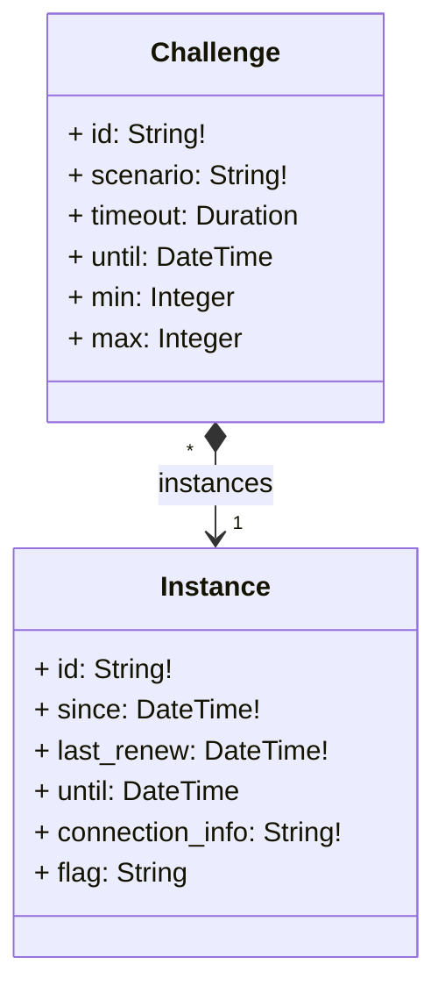

In the process of architecting a microservice, a first thing is to clarify the goal of this service: managing challenges and their respective instances lifecycles.
Then, its technical objectives are declined in two services according to the [Separation of Concerns Principle](https://en.wikipedia.org/wiki/Separation_of_concerns): `ChallengeStore` and `InstanceManager`. To fulfill their respective objectives, we construct their datamodels and the API contracts.
Then you implement it, write the underlying software that provides the service, and think of its deployment architecture.

## API

We decided to avoid manual API conception issues by using a [Model Based Systems Engineering](https://en.wikipedia.org/wiki/Model-based_systems_engineering) approach, to focus on the functionalities. This results in less maintenance and an improved quality and stability over API practices.

This API revolve around a simplistic class diagram as follows.

Then, we described these models in [protobuf](https://protobuf.dev/), and using [`buf`](https://buf.build/) we generated the Golang code for those services (Text-To-Text transform). The [gRPC](https://grpc.io/) API would then be usable by any service that would want to make use of the service.

Additionally, for documentation and ease of integration, we wanted a REST JSON API: through a [gateway](https://github.com/grpc-ecosystem/grpc-gateway) and a [swagger](https://swagger.io/), that was performed still in a code-generation approach.

## Software

Based on the generated code, we implement the functionalities to fulfill our goals.


Functionalities and interactions of the chall-manager services, from a software point of view.


Nothing very special here, it was basically features implementation. This was made possible thanks to the Pulumi API that can be manipulated directly as a Go module with the [`auto`](https://github.com/pulumi/pulumi/tree/master/sdk/go/auto) package.

Notice there is an additional role assigned to the `ChallengeStore`: the `Pooler`. It pre-deploys instances of challenges for performances. This one is currently embedded but might be externalised in a future architecture iteration.

## Components

To store Pulumi programs, stacks and state, we decided to avoid depending on a file-database such as an [S3](https://docs.aws.amazon.com/pdfs/AmazonS3/latest/API/s3-api.pdf)-compatible (AWS S3 or [MinIO](https://min.io/)) volume. First reason is that some services are not be compatible for offline deployments. Second reason is license compliance for business-oriented use cases (e.g. [MinIO license is GNU AGPL-v3.0](https://github.com/minio/minio/blob/master/LICENSE), [Garage](https://garagehq.deuxfleurs.fr/) too).
To solve this problem we use a **filesystem-based storage**. It is at the charge of the operational entity to manage data replication, exports, ... Many choices here too: [Longhorn](https://longhorn.io), [Ceph](https://ceph.io/), or any other exist. This decision might change in the future, but we try to stick with the requirements of offline and free-to-use/free-to-sell for now.

Nonetheless, to distribute scenarios and reuse [recipes](https://github.com/ctfer-io/recipes) we opted for an **[Open Container Initiative](https://opencontainers.org/) storage**. Various projects are compatible: [Docker Registry](https://hub.docker.com/_/registry), [Zot](https://github.com/project-zot/zot), [Artifactory](https://github.com/project-zot/zot), ... One of the advantage that natively arises comes from security practices, tooling, data replication and deduplication.
In order to manipulate these OCI blobs we use [ORAS](https://oras.land).
A scenario is technically a directory (possibly with sub-directories) packed in an OCI blob, with each file annotated `application/vnd.ctfer-io.file`.

To guarantee the atomicity of the operations performed by Chall-Manager, even at scale, and keep the integrity of data we required a **distributed locking system**. We chose **[etcd](https://etcd.io)** as it has been battle-tested with Kubernetes for years. File storage replication would be handled by another solution like . This is further detailed in [High-Availability](/docs/chall-manager/design/high-availability).


In our design, we deploy an etcd instance rather than using the Kubernetes already existing one. By doing so, we avoid deep integration of our proposal into the cluster which enables multiple instances to run in parallel inside an already existing cluster. Additionnaly, it avoids innapropriate service intimacy and shared persistence issues described as good development practices in Micro Services architectures by [Taibi et al. (2020)](https://doi.org/10.1007/978-3-030-31646-4_5) and [Bogard (2017)](https://www.youtube.com/watch?v=gfh-VCTwMw8). Finally, it simply does not tie Chall-Manager to a Kubernetes cluster such that it is not a Kubernetes-only system.


For signals such as metrics, logs and traces (as it is intended to be used in distributed system) we decided to ship native support of **[OpenTelemetry](https://opentelemetry.io/)**. Chall-Manager can export all these signals to an external OTLP-compatible collector, which is then used to process and export to downstream consumers (e.g. Jaeger, Prometheus).

## Deployment

Deploying Chall-Manager has been an interesting discussion due to the various capabilities that could be activated, or not.
To create a good deployment strategy, we have to make use of variability. As we keep in mind online, offline and on-premise contexts, we wanted to be able to deploy on a non-vendor-specific hypervisor everyone would be free to use. **We chose Kubernetes**.

Then, we have to determine what we expect to be an internal and an external component of the system:
- External:
  - filesystem replication (e.g. Longhorn) ;
  - OTLP-compatible collector (e.g. OpenTelemetry Collector) ;
  - OCI registry for scenarios (e.g. Zot).
- Internal:
  - chall-manager, chall-manager-janitor (obviously 💅) ;
  - distributed locks: **etcd** ;

External components wont' be part of the deployed system and are expected to be deployed by alternative means.
With this classification, we define the following architecture for a Kubernetes-based deployment.


The Kubernetes deployment of a chall-manager.


One opportunity of this approach is, as chall-manager is as close as possible to the Kubernetes provider (intra-cluster), it will be easily feasible to manage resources in it. Using this, [ChallMaker](/docs/chall-manager/glossary#challmaker) and [Ops](/docs/chall-manager/glossary#ops) could deploy [instances](/docs/chall-manager/glossary#instance) on Demand with a minimal effort. It makes Chall-Manager a Kubernetes-native application.

Despite these many reasons, one who don't have or want to have a Kubernetes to manipulate the technology is able to deploy it out of such orchestrator.
We document [alternative deployments in the Ops guides](/docs/chall-manager/ops-guides/deployment).

## What's next ?

In the next section, you will understand how data consistency is performed at scale with the balance of [High Availability](/docs/chall-manager/design/high-availability).
