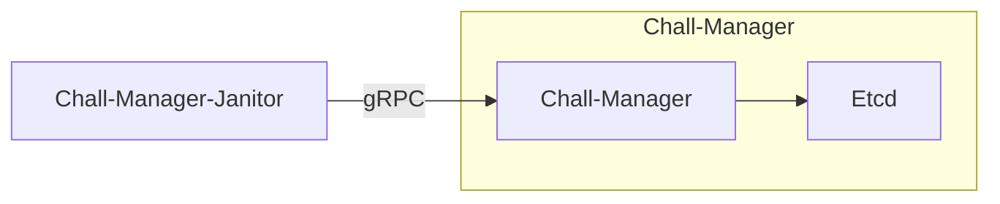
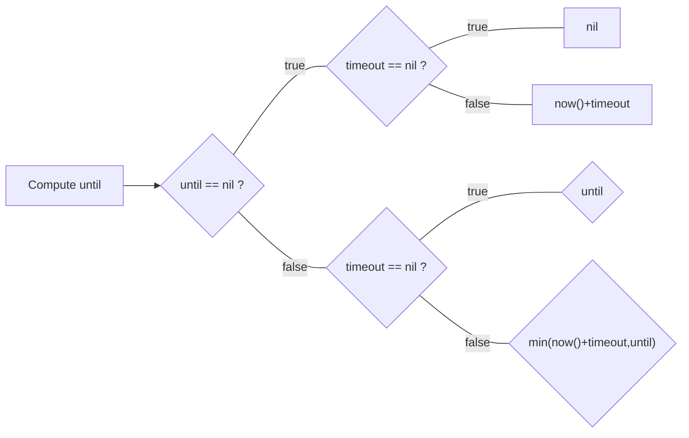

## Context

During the CTF, we don't want players to be capable of manipulating the infrastructure at their will: starting instances are costful, require computational capabilities, etc.
It is mandatory to control this while providing the players the power to manipulate their instances at their own will: it is a sweet spot, which might not be so easy to find.

For this reason, one goal of the chall-manager is to provide ephemeral (or not) [scenarios](/docs/chall-manager/glossary#scenario). Ephemeral imply lifetimes, expirations then deletions.
To implement this, for each `Challenge` the [ChallMaker](/docs/chall-manager/glossary#challmaker) and [Ops](/docs/chall-manager/glossary#ops) can set a `timeout` in seconds after which the `Instance` will be deleted once up & running, or an `until` date after which the instance will be deleted whatever the timeout. When an `Instance` is deployed, its start date is saved, and every update is stored for traceability. A participant (or a dependent service) can then renew an instance on demand for additional time, as long as it is under the `until` date of the challenge. This is based on a hypothesis that a challenge should be solved after \\(n\\) minutes.


The timeout should be evaluated based on expert's point of view regarding the complexity of the conceived challenge, with a consideration of the participant skill sets (an expert can be expected to solve an introduction challenge in seconds, while a beginer can take several minutes).

There is no "rule of the thumb", but we recommend double-testing the challenge by **both a domain-expert** for technical difficulty **and another ChallMaker** unrelated to this domain.


Deleting [instances](/docs/chall-manager/glossary#instance) when outdated then becomes a new goal of the system, thus we cannot extend the chall-manager as it would be a rupture of the [Separation of Concerns Principle](https://en.wikipedia.org/wiki/Separation_of_concerns): it is the goal of another service, `chall-manager-janitor`. This is also justified by the frequency model applied to the janitor, which is unrelated to the `chall-manager` service itself.
With such approach, other players could use the resources. Nevertheless, it requires a mecanism to wipe out infrastructure resources after a given time.
Some tools exist to do so.

| Tool | Environment |
|---|:---:|
| [hjacobs/kube-janitor](https://codeberg.org/hjacobs/kube-janitor) | Kubernetes |
| [kubernetes-sig/boskos](https://github.com/kubernetes-sig/boskos) | Kubernetes |
| [rancher/aws-janitor](https://github.com/rancher/aws-janitor) | AWS |

Despite tools exist, they are context-specifics thus are limited: each one has its own mecanism and only 1 environment is considered.
As of [genericity](/docs/chall-manager/design/genericity), we want a generic approach able to handle all ecosystems without the need for specific implementations.
For instance, if [ChallMakers](/docs/chall-manager/glossary#challmaker) decide to cover a unique, private and offline ecosystem, how could they do ?

That is why the janitor must have the same level of genericity as chall-manager itself.
Despite it is not optimal for specifics providers, we except this genericity to be a better tradeoff than covering a limited set of technologies. This modular approach enable covering new providers (vendor-specifics, public or private) without involving CTFer.io in the loop.

## How it works

By using the [chall-manager API](/docs/chall-manager/design/architecture#api), the `janitor` looks up at expiration dates.
Once an instance is expired, it simply deletes it.
Using a cron, the janitor could then monitor the instances frequently.

If two janitors triggers in parallel, the API will maintain consistency. Errors code are to expect, but no data inconsistency.

As it does not plugs into a specific provider mecanism nor requirement, it guarantees platform agnosticity. Whatever the [scenario](/docs/chall-manager/glossary#scenario), the `chall-manager-janitor` will be able to handle it.

Follows the algorithm used to determine the instance `until` date based on a challenge configuration for both `until` and `timeout`.
Renewing an instance re-execute this to ensure consistency with the challenge configuration.
Based on the instance `until` date, the janitor will determine whether to delete it or not (\\(instance.until > now() \Rightarrow delete(instance)\\)).

## What's next ?

Listening to the community first feedbacks, we tried to lower the bar to hop in with Chall-Manager.
We then created a [Software Development Kit](/docs/chall-manager/design/software-development-kit).
