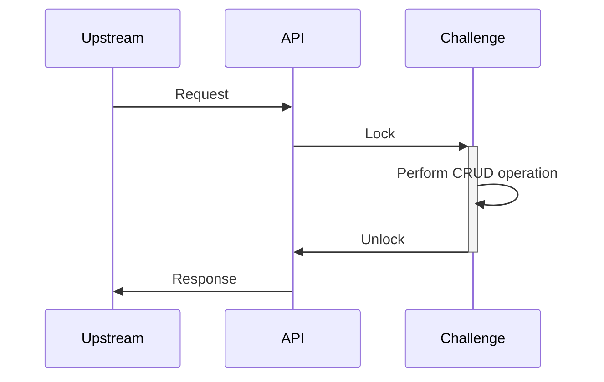
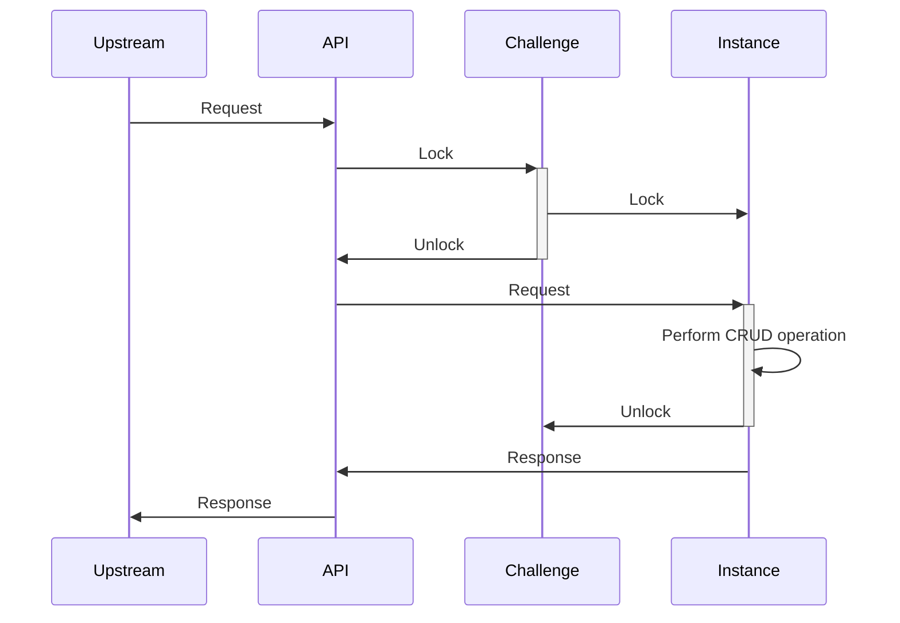
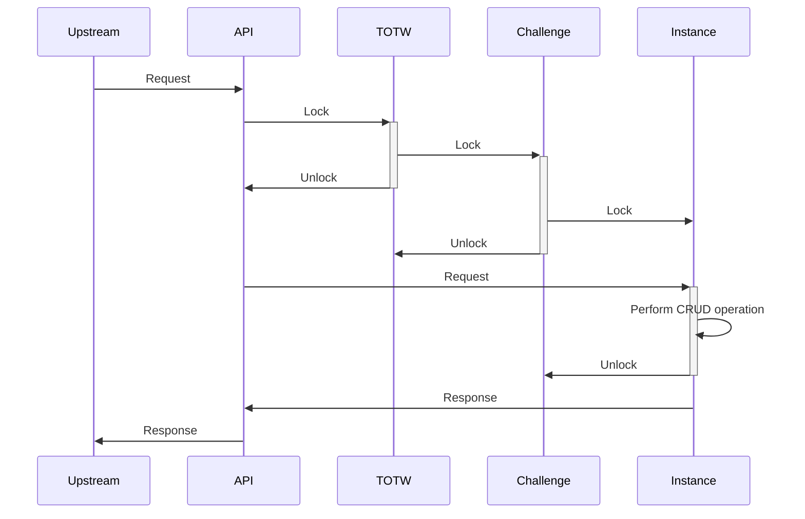

When designing an highly available application, the Availability and Consistency are often defered to the database layer.
This database explains its tradeoff(s) according to the [CAP theorem](https://en.wikipedia.org/wiki/CAP_theorem).
Nevertheless, chall-manager does not use a database but a distributed locking mecanism and filesystem-based storage. _Why so ??_ would you ask.

First of all, some definitions:
- **Availability** is the characteristic of a service to be reachable by a downstream consumer ;
- **High Availability** contains Availability, with minimal interruptions of services and response times as low as possible. That is the point where Service Level Agreements are in mind.

To perform High Availability, you can think of update strategies such as a Rolling Update with a maximum unavailability rate, replicate instances, etc.
But it depends on a property: the application must be scalable (many instances in parallel should not overlap in their workloads if not designed so), have availability and consistency mecanisms integrated.

One question then arise: how do we assure consistency with a maximal availability ?

## Fallback

As Chall-Manager should scale, the locking mecanism must be distributed. In case of a network failure, it imply that whatever the final decision, the implementation should provide a recovery mecanism of the locks.

## Transactions

A first reflex would be to think of [transactions](https://en.wikipedia.org/wiki/Transaction_processing). They guarantee data consistency, so would be good candidates.
Nevertheless, as we are not using a database that implements it, we would have to design and implement those ourselves.
Such an implementation is costfull and should only happen when reusability is a key aspect. As it is not the case here (specific to chall-manager), it was a counter-argument.

## Mutex

Another reflex would be to think of (distributed) [mutexes](https://en.wikipedia.org/wiki/Lock_(computer_science)).
Through a mutual exclusion, we would be sure to guarantee data consistency, but nearly no availability.
Indeed, a single mutex would lock out all incoming requests until the operation is completly performed. Even if it would be easy to implement, it does not match our requirements.

Such implementation would look like the following.



## Multiple mutex

We need something _thinner_ than (distributed) [mutex](#mutex), scoped: if a challenge A is under a CRUD operation, we don't need challenge B to not be able to handle another CRUD operation!

To do so, we can imagine one (distributed) mutex per challenge such that they won't stuck one another by enabling parallel process-ability.
Ok, that's fine... But what about instances?

The same problem twice, the same solution twice: we can construct a chain of mutexes such that to perform a CRUD operation on an `Instance`, we lock the `Challenge` first, then the `Instance`, unlock the `Challenge`, execute the operation, and unlock the `Instance`. This enables re-scoping the critical code to a sub-model of the whole. An API call from an upstream source or service is represented with this strategy as follows.



One last thing: what if we want to query all challenges information (to build a dashboard, janitor outdated instances, ...) ?
We would need a "[Stop The World](https://en.wikipedia.org/wiki/Tracing_garbage_collection#Stop-the-world_vs._incremental_vs._concurrent)"-like mutex from which every challenge mutex would require context-relock before operation. In order to avoid confusions with the Garbage Collector concept, we call this a "Top-of-the-World" aka `TOTW`.

The previous would now become the following.



That would guarantee consistency of the data while having availability on the API resources.
Nevertheless, this availability is not high availability: we could enhance further.

## Writer-Preference Reader-Writer Distributed Lock

All CRUD operations are not equal, and can be simplistically separated in two groups:
- reading (Query, Read);
- writing (Create, Update, Delete).

The reading operations does not affect the state of an API object, while writing ones does.
Moreover, in the case of Chall-Manager, reading operations are nearly instantaneous and writing ones might at least be 10-seconds long.
How to deal with those unbalanced operations ?

Looking back into history, as soon as discussions on [OS](https://en.wikipedia.org/wiki/Operating_system) began, researchers worked on the similar question and found solutions. They called this one the "reader-writer problem".
By previously modeling a Reader-Writer lock for faster API responses, and using the [Courtois et al. (1971)](https://doi.org/10.1145/362759.362813) second problem solution for writer-preference reader-writer solution, we would need 5 locks and 2 counters.
In our specific case, we want writer-preference as they would largely affect the state of the resources.

Note that this implementation does not guarantee fairness in request ordering, as they are not queued.

For the technical implementation, we have multiple solutions providing distributed mutexes and counters: [etcd](https://etcd.io), [redis](https://redis.io/) or [valkey](https://valkey.io/).
Our choice went to etcd for its ease of deployment with the Bitnami charts along with its proven efficiency (especially being the backend of Kubernetes), and thanks to the [etcd client v3](https://github.com/etcdv3/etcd-client) already implementing mutexes and counters. Additionally, according to the [CAP theorem](https://en.wikipedia.org/wiki/CAP_theorem) such distributed systems are only XP with X being either Availability or Consistency: etcd is CP-first while redis/valkey are AP-first, hindering the need for consistency.


The triple chain of writer-preference reader-writer distributed locks.


With this approach, we could ensure data consistency throughout all replicas of Chall-Manager, and high-availability through faster API responses.

## Recovery

When working with distributed systems, we have multiple factors that can affect the synchronization mecanisms: timings, networking, session management... And all can introduce errors.
These errors are not considered in Courtois et al. (1971) work. Nonetheless, locking a mutex can fail in the middle of a reader-writer lock or unlock operation.
If such error is not recovered, the operation is no longer (somewhat) atomic, thus some mutex states and counter values might have been altered incompletly (in a state that does no match Courtois et al. conditions).

Conceptualizing that RW operations should be atomic, we have to handle errors and implement the RW locks with recovery as a first principle.
In order to do such, we can model each reader lock, reader unlock, writer lock and writer unlock as a set of:
- **initial** steps, that prepare the operation;
- **altering** steps, that alter the state of the RW-preference, i.e., a mutex or counter that is not recovered to its initial state in its own lock/unlock execution, except for `w` due to writer-preference;
- **mandatory** steps, that must be performed once one altering step has run.


The steps decomposition of Courtois et al. (1971) Reader-Writer Writer-Preference lock and unlock operations.


In order to recover, the implementation must follow the algorithm:
- ahead of execution, for each initial step, virtually define a recovering counter-operation (e.g., if `P(x)` then its counter-operation is `V(x)`);
- create a stack of counter-operations;
- for each step during exeution, if is initial adds the counter-operation on a stack;
- for each step, if is a counter-operation in the stack, pop it out (considered recovered);
- once the first altering step is reached, we use a non-cancellable context such that we MUST terminate;
- if somewhere during execution there is an error, the stack counter-operations must be executed in reverse order of appending (LIFO ordering).

Using this algorithm, a cancelation in the request or a downstream error end up recovering on Courtois et al. (1971) conditions such that future execution are non-stuck.
Its recoverable operation principle is borrowed from the [sagas](https://doi.org/10.1145/38714.38742).
Nonetheless, if the underlying mutex and counter system fails during the altering steps, the states would end up stuck requiring a reset of the locks and counters.

Note that in the case of the writer unlock, we cannot easily recover from the `V(w)` in the initial steps as its counter-operation is a `P(w)`. Indeed, due to the unfaireness of the Courtois et al. (1971) second problem solution, we cannot prioritize this recovery over parallel requests. If we begin by executing it, and `P(mutex 2)` fails then we have to consider its initial steps as altering ones, increasing the potential for errors.
For this reason, we use a reasonable alternative that is more time-consuming but keep the properties of synchronization and preference.

```
P(mutex 2);
writercount := writecount - 1;
if writecount = 0 then V(r);
V(mutex 2);
V(w); # moved here, so MUST be executed once the critical steps are reached
```

## CRDT

Can a [Conflict-Free Replicated data Type](https://en.wikipedia.org/wiki/Conflict-free_replicated_data_type) have been a solution ?

In our case, we are not looking for **eventual** consistency, but strict consistency. Moreover, using CRDT is costfull in development, integration and operation, so if avoidable they should be. CRDT are not the best tool to use here.
It might be a good future work, but is currently not a priority.

## What's next ?

Based on the guarantee of consistency and high availability, inform you on the other major problem: [Hot Update](/docs/chall-manager/design/hot-update).
