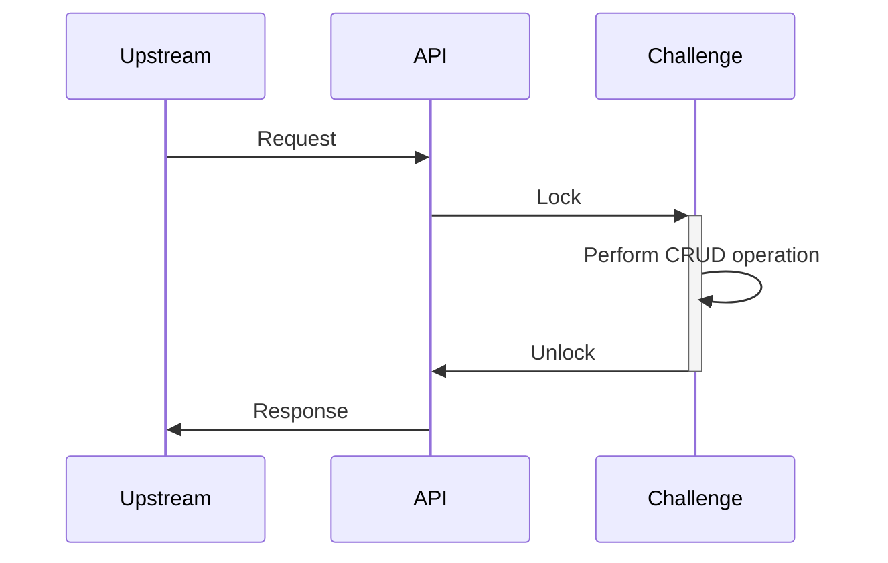
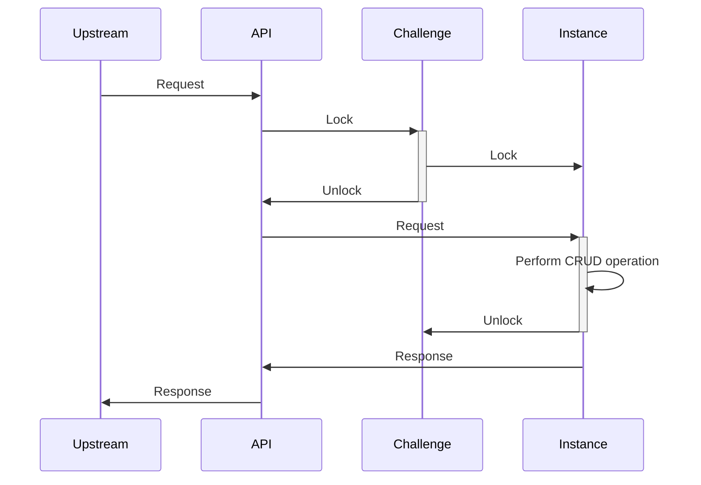
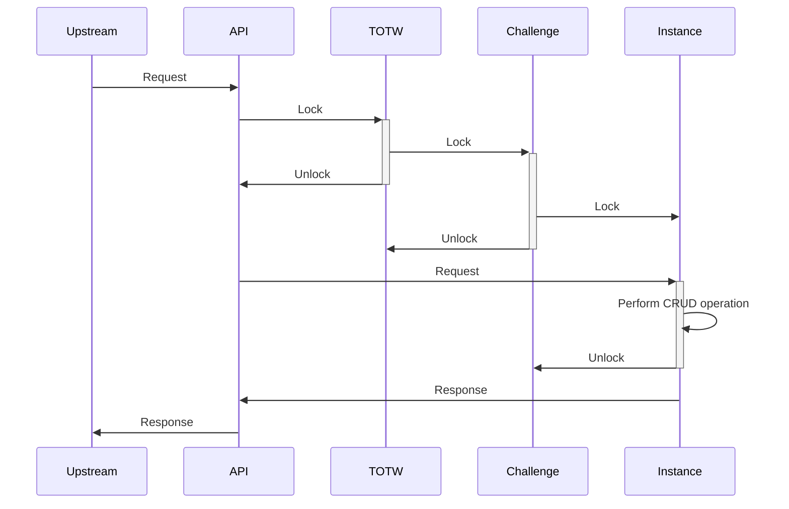

When designing an highly available application, the Availability and Consistency are often deffered to the database layer.
Nevertheless, chall-manager does not use a database for simplicity of use.

First of all, a quick taxonomy:
- **Availability** is the characteristic of an application to be reachable to the final user of services.
- **High Availability** contains Availability, with minimal interruptions of services and response times as low as possible.

To perform High Availability, you can use update strategies such as a Rolling Update with a maximum unavailability rate, replicate instances, etc.
But it depends on a property: the application must be scalable (many instances in parallel should not overlap in their workloads if not designed so), have availability and consistency mecanisms integrated.

One question then arise: how do we assure consistency with a maximal availability ?

## Fallback

As the chall-manager should scale, the locking mecanism must be distributed. In case of a network failure, it imply that whatever the final decision, the implementation should provide a recovery mecanism of the locks.

## Transactions

A first reflex would be to think of [transactions](https://en.wikipedia.org/wiki/Transaction_processing). They guarantee data consistency, so would be good candidates.
Nevertheless, as we are not using a database that implements it, we would have to design and implement those ourselves.
Such an implementation is costfull and should only happen when reusability is a key aspect. As it is not the case here (specific to chall-manager), it was a counter-argument.

## Mutex

Another reflex would be to think of (distributed) [mutexes](https://en.wikipedia.org/wiki/Lock_(computer_science)).
Through a mutual exclusion, we would be sure to guarantee data consistency, but nearly no availability.
Indeed, a single mutex would lock out all incoming requests until the operation is completly performed. Even if it would be easy to implement, it does not match our requirements.

Such implementation would look like the following.

## Multiple mutex

We need something finer than (distributed) [mutex](#mutex): if a challenge A is under a CRUD operation, we don't need challenge B to not be able to handle another CRUD operation !

We can imagine one (distributed) mutex per challenge such that they won't stuck one another.
Ok, that's fine... But what about instances ?

The same problem arise, the same solution: we can construct a chain of mutexes such that to perform a CRUD operation on an `Instance`, we lock the `Challenge` first, then the `Instance`, unlock the `Challenge`, execute the operation, and unlock the `Instance`. An API call from an upstream source or service is represented with this strategy as follows.

One last thing, what if we want to query all challenges information (to build a dashboard, janitor outdated instances, ...) ?
We would need a "[Stop The World](https://en.wikipedia.org/wiki/Tracing_garbage_collection#Stop-the-world_vs._incremental_vs._concurrent)"-like mutex from which every challenge mutex would require context-relock before operation. To differenciate this from the Garbage Collector ideas, we call this a "Top-of-the-World" aka `TOTW`.

The previous would now become the following.

That would guarantee consistency of the data while having availability on the API resources.
Nevertheless, this availability is not high availability: we could enhance further.

## Writer-Preference Reader-Writer Distributed Lock

All CRUD operations are not equal, and can be split in two groups:
- reading (Query, Read)
- writing (Create, Update, Delete).

The reading operations does not affect the state of an object, while writing ones does.
Moreover, in the case of chall-manager, reading operations are nearly instantaneous and writing ones are at least 10-seconds long.
How to deal with those unbalanced operations ?

As soon as discussions on [OS](https://en.wikipedia.org/wiki/Operating_system) began, researchers worked on the similar question and found solutions. They called this one the "reader-writer problem".

In our specific case, we want writer-preference as they would largely affect the state of the resources.
Using the [Courtois et al. (1971)](https://doi.org/10.1145/362759.362813) second problem solution for writer-preference reader-writer solution, we would need 5 locks and 2 counters.

For the technical implementation, we have multiple solutions: [etcd](https://etcd.io), [redis](https://redis.io/) or [valkey](https://valkey.io/).
We decided to choose etcd because it was already used by Kubernetes, and the [etcd client v3](https://github.com/etcdv3/etcd-client) already implement mutex and counters.


The triple chain of writer-preference reader-writer distributed locks.


With this approach, we could ensure data consistency throughout all replicas of chall-manager, and high-availability.

## CRDT

Can a [Conflict-Free Replicated data Type](https://en.wikipedia.org/wiki/Conflict-free_replicated_data_type) have been a solution ?

In our case, we are not looking for **eventual** consistency, but strict consistency. Moreover, using CRDT is costfull in implementing and using, so if avoidable they should be. CRDT are not the best tool to use here.

## What's next ?

Based on the guarantee of consistency and high availability, inform you on the other major problem: [Hot Update](/docs/chall-manager/design/hot-update).
