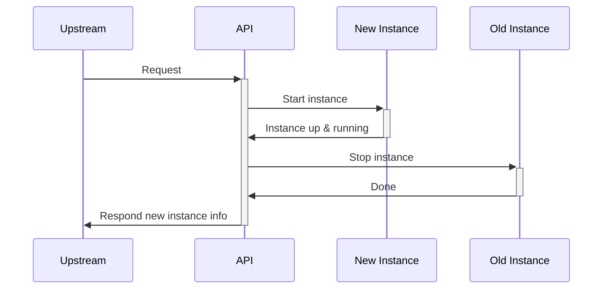
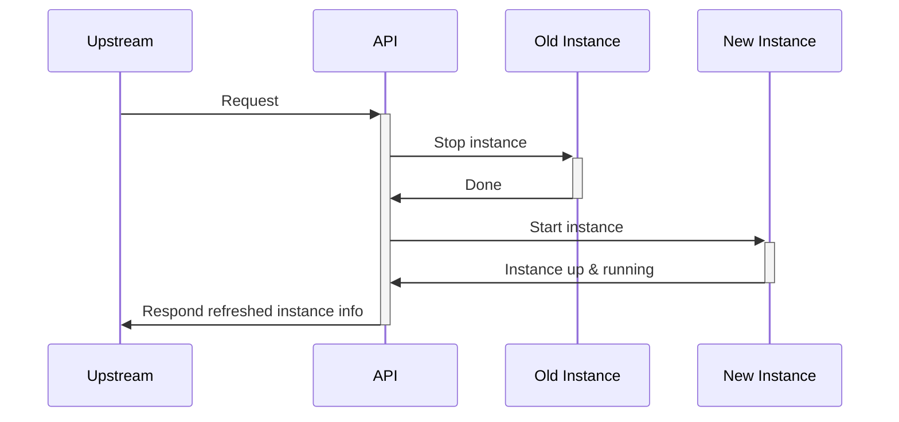
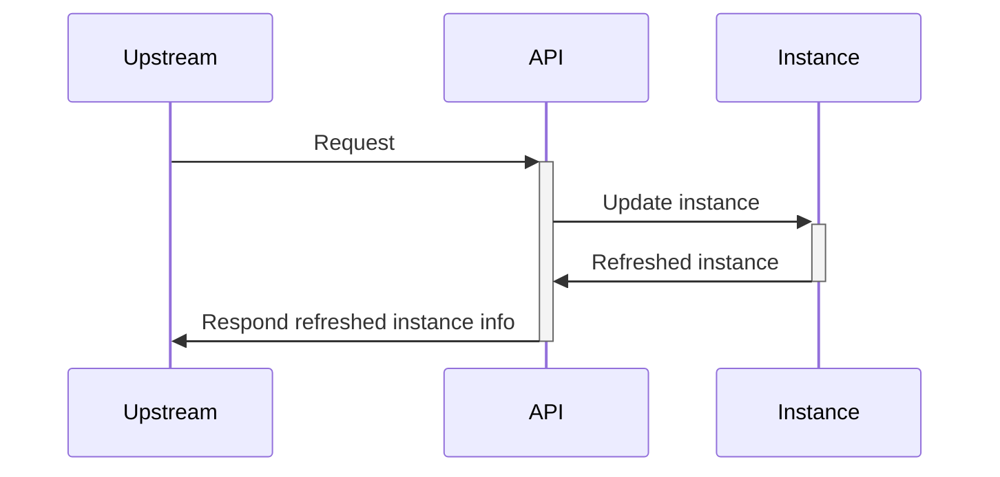

When a challenge is affected by a bug leading to the impossibility of solving it, or if an unexpected solve is found, you will most probably want it fixed for fairness.

If this happens on challenge with low requirements, you will fix the description, files, hints, etc.
But what about challenges that require infrastructures ? You may fix the [scenario](/docs/chall-manager/glossary#scenario), but it won't fix the already-existing [instances](/docs/chall-manager/glossary#instance).
If no instance has been deployed, it is fine: fixing the scenario is sufficient. Once instances has been deployed, we require a mecanism to perform this update automatically.

A reflex when dealing with a question of updates and deliveries is to refer to [The Update Framework](https://theupdateframework.io/).
With the embodiement of its principles, we wanted to provide macro models for hot update mecanisms.
To do this, we listed a bunch of deployment strategies, analysed their inner concepts and group them on this.

<table><thead>
  <tr>
    <th>Precise model</th>
    <th>Applicable</th>
    <th>Macro model</th>
  </tr></thead>
<tbody>
  <tr>
    <td>Blue-Green deployment</td>
    <td align="center">✅</td>
    <td rowspan="6">Blue-Green</td>
  </tr>
  <tr>
    <td>Canary deployment</td>
    <td align="center">✅</td>
  </tr>
  <tr>
    <td>Rolling deployment</td>
    <td align="center">✅</td>
  </tr>
  <tr>
    <td>A/B testing</td>
    <td align="center">✅</td>
  </tr>
  <tr>
    <td>Shadow deployment</td>
    <td align="center">✅</td>
  </tr>
  <tr>
    <td>Red-Black deployment</td>
    <td align="center">✅</td>
  </tr>
  <tr>
    <td>Highlander deployment</td>
    <td align="center">✅</td>
    <td rowspan="2">Recreate</td>
  </tr>
  <tr>
    <td>Recreate deployment</td>
    <td align="center">✅</td>
  </tr>
  <tr>
    <td>Update-in-place deployment</td>
    <td align="center">✅</td>
    <td>Update-in-place</td>
  </tr>
  <tr>
    <td>Immutable infrastructure</td>
    <td align="center">❌</td>
    <td></td>
  </tr>
  <tr>
    <td>Feature toggles</td>
    <td align="center">❌</td>
    <td></td>
  </tr>
  <tr>
    <td>Dark launches</td>
    <td align="center">❌</td>
    <td></td>
  </tr>
  <tr>
    <td>Ramped deployment</td>
    <td align="center">❌</td>
    <td></td>
  </tr>
  <tr>
    <td>Serverless deployment</td>
    <td align="center">❌</td>
    <td></td>
  </tr>
  <tr>
    <td>Multi-cloud deployment</td>
    <td align="center">❌</td>
    <td></td>
  </tr>
</tbody></table>

Strategies were classified not applicable when they did not include update mecanisms.

With the 3 macro models, we define 3 hot update strategies.

## Blue-Green

The blue-green update strategy starts a new instance with the new scenario, and once it is done shuts down the old one.

It requires both instances in parallel, thus is a **resources-consuming** update strategy. Nevertheless, it reduces **services interruptions to low or none**.
To the extreme, the infrastructure should be able to handle **two times** the instances load.

## Recreate

The recreate update strategy shuts down the old one, then starts a new instance with the new scenario.

It is a **resources-saving** update strategy, but imply **services interruptions** enough time to stop the old instance and starts a new one.
To the extreme, it **does not require additional resources** more than one time the instance load.

## Update-in-place

The update-in-place update strategy loads the new scenario and update resources in live.

It is a **resource-saving** update strategy, that imply **low to none services interruptions**, but require **robustness in the update mecanisms**. If the update mecanisms are not robust, we do not recommend this one as it could soft-lock resources in the providers.
To the extreme, it **does not require additional resources** more than one time the instance load.

## Overall

| Update Strategy | Require Robustness¹ | Time efficiency | Cost efficiency | Availability | TL;DR; |
|---|:---:|:---:|:---:|:---:|---|
| Update in place | ✅ | ✅ | ✅ | ✅ | Efficient in time & cost ; require high maturity |
| Blue-Green      | ❌ | ✅ | ❌ | ✅ | Efficient in time ; costfull |
| Recreate        | ❌ | ❌ | ✅ | ❌ | Efficient in cost ; time consuming |

¹ Robustness of both the provider and resources updates.

## What's next ?

How did we incorporate security in such a powerfull service ?
Find answers in [Security](/docs/chall-manager/design/security).
