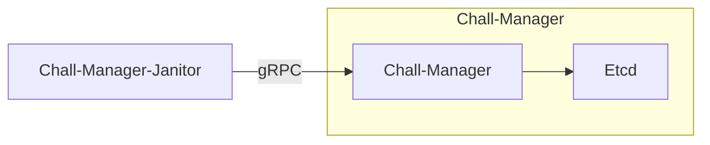

One goal of the chall-manager is to provide ephemeral [scenarios](/docs/chall-manager/glossary#scenario). Ephemeral imply lifetimes, thus deletions.
To delete [instances](/docs/chall-manager/glossary#instance) when outdated, we cannot extend the chall-manager as it would be a rupture of the [Separation of Concerns Principle](https://en.wikipedia.org/wiki/Separation_of_concerns): it is the goal of another service, `chall-manager-janitor`.

During the CTF, we don't want players to be capable of manipulating the infrastructure at their will: starting instances are costful, require computational capabilities, etc.
It is mandatory to control this while providing the players the power to manipulate their instances.

One of the control is rate limiting, but is considered out of our scope: players cannot start all possible instances. This behavior should be implemented by the CTF platform.

## Context

Another is resources consumption: a player has the right to consume infrastructure resources, but are limited in the time they use them. This is based on a hypothesis that a challenge should be solved after \\(n\\) minutes. With such approach, other players could use the resources. Nevertheless, it requires a mecanism to wipe out infrastructure resources after a given time.
Some tools exist to do so.

| Tool | Environment |
|---|:---:|
| [hjacobs/kube-janitor](https://github.com/hjacobs/kube-janitor) | Kubernetes |
| [kubernetes-sig/boskos](https://github.com/kubernetes-sig/boskos) | Kubernetes |
| [rancher/aws-janitor](https://github.com/rancher/aws-janitor) | AWS |

Despite tools exist, they are context-specifics thus are limited: each one has its own mecanism and only 1 environment is considered.
As of [genericity](/docs/chall-manager/design/genericity), we want a generic approach able to handle all ecosystems without the need for specific implementations.
For instance, if a [ChallMaker](/docs/chall-manager/glossary#challmaker) decides to cover a unique, private and offline ecosystem, how could (s)he do ?

That is why the janitor must have the same level of genericity as chall-manager itself.

## How it works

By using the [chall-manager API](/docs/chall-manager/design/architecture#api), the `janitor` looks up at expiration dates.
Once an instance is expired, it simply deletes it.
Using a cron, the janitor could then monitor the instances frequently.

If two janitors triggers in parallel, the API will maintain consistency. Errors code are to expect, but no data inconsistency.

As it does not plugs into a specific provider mecanism nor requirement, it guarantees platform agnosticity. Whatever the [scenario](/docs/chall-manager/glossary#scenario), the `chall-manager-janitor` will be able to handle it.

## What's next ?

Listening to the community, we decided to improve further with a [Software Development Kit](/docs/chall-manager/design/software-development-kit).
