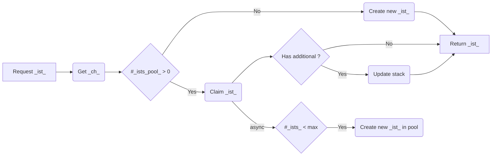


Ahead of any explanation, it must be understood that **the pooler**, despite being a major feature for quality, **is to deeply consider regarding infrastructure overhead between Ops and ChallMakers**. It may increase your infrastructure load until DoS or largely raise the bill for hosting instances without them being used.

It is nonetheless vital whenever giving players the best experience is part of your project.


## Context

Due to [the genericity of the design](/docs/chall-manager/design/genericity/) the abstraction layer imply generic operations. For instance, loading the Pulumi stack might take seconds, and by summing up all of operations happening behind the curtains, it forms an uncompressible time to handle an API request.
Then, deploying the resources can take several seconds up to several minutes depending on the [scenario](/docs/chall-manager/glossary/#scenario). Finally, writing it all down on the filesystem and serving the result adds more time to the response.

Through this process, there are uncompressible times, with mostly the only variation depending on the scenario. Increasing the direct throughout of Chall-Manager can then focus on 3 things :
1. Filesystem operations, but have a small impact on the overall plus would be dangerous to do it ourself rather than depending on Go's amazing team work ;
2. Improving locking operations, reducing the consistency of data thus be dangerous with unpredictable errors ;
3. Improve Pulumi's code to go faster, but with such a complex codebase might end up being a highly complex unmaintainable mess.

Based on this, we consider there is no room for improving the process, in our scope.

An approach that would perhaps work would be to pre-provision instances for your players such that everyone as its own whenever they want to.
This would work under the condition that you know how many players you have, but would also decrease your infrastructure capability as you would require a lot of probably unused resources (e.g. CPUs) that could benefit elsewhere.

Nonetheless, what we can change in our scope are **the workflows**.
Indeed, what if instead of deploying instances on demand, or deploying them all ahead of being requested, we deploy them before by creating **a pool of already-deployed instance** ?
In this model, instance can either be _claimed_ by a _source_ or pre-provisionned into a pool (not both, of course).

To implement this, we create a new "Service" called the _Pooler_. Each challenge has its own, disabled by default (`min=0, max=0`).
A pooler is defined per attributes:
- `min` (default=0) which defines how many instances should be pre-deployed ;
- `max` (default=0) which defines a threshold after which it stops pre-provisionning them.

Setting a `max != 0` but `min = 0` has no impact on the pooler i.e. won't pre-deploy any instance.

## Requesting an instance

Running the pooler end up separating running instances in two groups:
- the _claimed_ instances, which are instances assigned to sources ;
- the _pooled_ instances, not claimed yet but available for so whenever required.


Visualization of a pooler turned on, with claimed and pooled instances.
Configuration is `min=2` and an unknown `max` that must be `>=3` in this case.


When a source issue the API call to create an instance (_ist_) of a challenge (_ch_), the following workflow occurs.

The API request to create the challenge spawns goroutines that will each be in charge of adding an instance in the pool. This is performed asynchronously such that it does not hold a long-living request, making automation around Chall-Manager easier.
The same pattern is triggered when an instance is picked from the pool and must be restored to its original capacity.

Nevertheless, it implies that if an instance is requested before there is any in the pool, it will deploy a brand new one rather than picking one in the pool.


Tests showed that from even a small scenario that does not deploy resources, **claiming an instance was around 640 µs**, while deploying a brand new one was between 2 to 3 seconds.
On a big scenario (e.g. a VM-based lab) that could take minutes to complete, the same performances are to expect, i.e. **from minutes to less than a millisecond**.


## Resizing

When a challenge is updated, if there is any change to the pooler configuration, the planned pool size is computed. Then the difference between the state and the plan is performed. If there are too many pooled instances running, the difference is deleted. Similarly, if there ain't enough, the difference is created. All untouched instances are updated as for the claimed instances.

The algorithm for this won't be detailed but lays [here](https://github.com/ctfer-io/chall-manager/tree/main/pkg/pool).

## Impact

To illustrate the impact problem of the pooler, let's consider an instance which costs 2 vCPUs, 8 Go of RAM and 20 Go of disk space. In this factice infrastructure, the limitating component is the CPU.
By itself, the infrastructure's capabilities might be sufficient to handle enough instances for all players, but with adjacent challenges and the backbone it becomes unviable. That way, you can't consider pre-provisionning all instances, and have not enough data to pre-provision part of them. A deployment takes 5 minutes so leads to an unacceptable quality for your players: you must use the pooler.

Using the pooler is a balance between time and experience from the [Player](/docs/chall-manager/glossary#player) and [ChallMaker](/docs/chall-manager/glossary#challmaker) perspective, but a balance between performances and costs for the [Ops](/docs/chall-manager/glossary#ops) and [Admins](/docs/chall-manager/glossary#administrator) perspective. When we discuss **costs** we consider the use of physical resources (e.g. CPU, RAM, disk), and the corresponding financial costs from a host/cloud service provider. This double balance between quality and costs leads to an undecidable problem.

To help in the decision, we recommend you consider the advantage of having instances in the pool depending mostly on the cost of one instance.
Under high load, there might be instances in the pool where the global knowledge should recommend not having some. This issue can simply be dealt with by updating the challenge with no change (it triggers the delta algorithm). Given these conditions, the worst case (infrastructure impact) is given by the sum of all individuals costs \\( c_i \\) of every possible instances in \\( \mathscr{I} \\): \\( cost = \sum_{i = 0 }^{\left| \mathscr{I} \right|} c_i \\).

By considering the individual cost \\( c_i \\) even for all instances as \\( c \\), it can be simplified as \\( cost = c \times \left| \mathscr{P} \right| = c \times \big(\left| pool \right| + \left| sources \right| \big) \\), with \\( \left| pool \right| \\) the minimum pool size (`min` attribute) and \\( \left| sources \right| \\) the total number of expected players in the worst case.

In prose, the **worst case cost** on infrastructure is given by the **total number of players and the minimum pool size multiplied by the mean cost of a single instance**. This last can be determined by the limitating characteristic of the hosting infrastructure.

## Use cases

The following are fictive yet realistic use cases of the pooler.

### Limited resources

Let's say we have a challenge that requires multiple VMs in network. We refer to such environment as a "lab".
This lab **takes too long to deploy**, thus would end up frustrating players, degrading the quality of the event.
For this reason, **you decide to use the pooler such that there is always some (e.g. 3) labs available for players to instantaneously pick from**.
Nevertheless, you have 30 teams thus won't require much more instances in the worst case. Moreover, with a lot of challenges, you only expect 10 teams at most in parallel.

You set up the pooler as `min=3` and `max=10`.
This means you want to have 3 labs deployed in parallel, ready to be claimed by your players, but won't require more than 10 (the worst case you consider) after which the pool stops working. Notice it does not block more instances to be deployed if your maths ends up inaccurate, but these won't be picked up quickly as they need to be freshly deployed.

Using these settings, players of your event will have a good feeling about the quality of your event, with time to focus on the challenge rather than waiting for the infrastructure to be ready.

### Online platform

Let's say you are using Chall-Manager as a backend service for an online cybersecurity training platform. You want to always have available instances for people -especially your VIPs- to train actively rather than clicking and having to wait several minutes.

**Based on the usage statistics** of previous similar challenges, the communication you put in place around it, **you expect an instance to be requested every 10 minutes in average** for the upcoming days, with a spike of 1 every minute for the first day. Experimentally, you measure an instance takes (for instance) 6 minutes to deploy.
You want to always have 20 instances such that there is also room for people who would like to retry the box from scratch (either they broke it, they want to try an automated solution, speedrun the box, test a write-up...).

You set up the pooler as `min=20`, and no `max`.
After the first day, you reconsider these settings and redefine `min=4`.
Finally, after a while you turn the pooler into a minimal level of availability, e.g. `min=2` and `max=4`.

This procedure makes your challenge able to handle the load of incoming requests without knowing how many people are going to try it.
However, these settings expects you have plenty infrastructure capabilities, enough to consider that you won't need a maximum at first. In that case, please actively monitor your resources to ensure there is no abuse, and if so, to take decisions on blocking people and/or set an arbitrary `max` value ahead of the plan.

## What's next ?

With all these capabilities in mind, how did we secure by design and by default the system ?
Answers in [Security](/docs/chall-manager/design/security).
