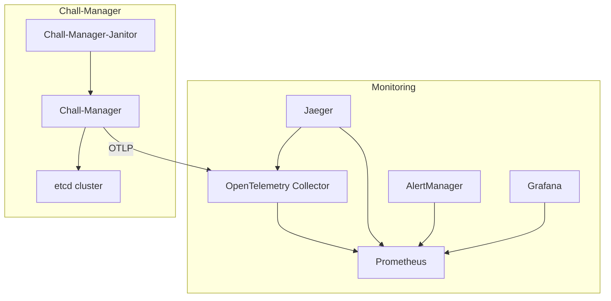

Once in production, the chall-manager provides its functionalities to the end-users.

But production can suffer from a lot of disruptions: network latencies, interruption of services, an unexpected bug, chaos engineering going a bit too far...
How can we monitor the chall-manager to make sure everything goes fine ?
What to monitor to quickly understand what is going on ?

## Metrics

A first approach to monitor what is going on inside the chall-manager is through its _metrics_.


Metrics are exported by the OTLP client.
If you did not configure an OTEL Collector, please refer to the [deployment documentation](/docs/chall-manager/ops-guides/deployment).


| Name | Type | Description |
|---|---|---|
| `challenges` | `int64` | The number of registered challenges. |
| `instances` | `int64` | The number of registered instances. |

You can use them to build dashboards, build KPI or anything else.
They can be interesting for you to better understand the tendencies of usage of chall-manager through an event.

## Tracing

A way to go deeper in understanding what is going on inside chall-manager is through _tracing_.

First of all, it will provide you information of latencies in the distributed locks system and Pulumi manipulations. Secondly, it will also provide you Service Performance Monitoring (SPM).

Using the OpenTelemetry Collector, you can configure it to produce RED metrics on the spans through the [spanmetrics connector](https://github.com/open-telemetry/opentelemetry-collector-contrib/blob/main/connector/spanmetricsconnector/README.md).
When a [Jaeger](https://www.jaegertracing.io/) is bound to both the OpenTelemetry Collector and the [Prometheus](https://prometheus.io/) containing the metrics, you can monitor performances AND visualize what happens.


An example view of the Service Performance Monitoring in Jaeger, using the OpenTelemetry Collector and Prometheus server.


Through the use of those metrics and tracing capabilities, you could build alerts thresholds and automate responses or on-call alerts with the [alertmanager](https://prometheus.io/docs/alerting/latest/alertmanager/).

A reference architecture to achieve this description follows.

