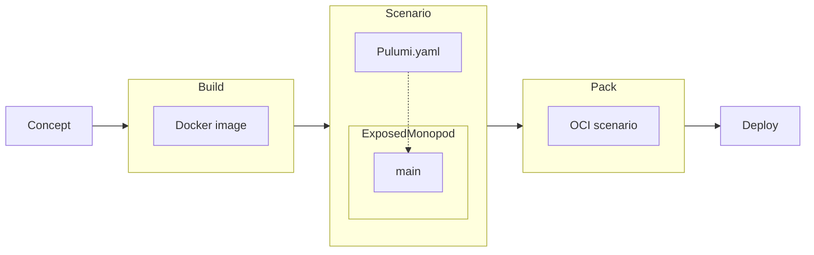
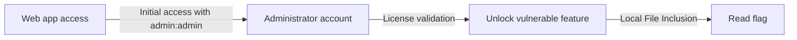

In the current documentation page, we will go through every step a [ChallMaker](/docs/chall-manager/glossary#challmaker) will encounter, from the concept to players deploying instances in production.



## The concept

Imagine you are a [ChallMaker](/docs/chall-manager/glossary#challmaker) who wants to challenge players on web application pentest.

The challenge is an application that require a licence to unlock functionalities, especially one that can read files vulnerable to local file inclusion. The initial access is due to an `admin`:`admin` account. The state of the application will be updated once the licence check is bypassed.
Its artistic direction is considered out of scope for now, but you'll find this example all along our documentation !



Obviously, you don't want players to impact others during their journey: [Challenge on Demand](/docs/chall-manager/glossary#challenge-on-demand) is a solution.

## Build the challenge

Using your bests software engineering skills, you conceive the application in the language of your choice, with the framework you are used to.
You quickly test it, everthing behaves as expected, so you cook a Write-Up for acceptance by reviewers.

This challenge is then packed into a Docker image: `account/challenge:latest`
We will then want to deploy this Docker image for every [source](/docs/chall-manager/glossary#source) that wants it.

## Construct the scenario

To deploy this scenario, we don't have big needs: one container, and a Kubernetes cluster.
We'll use the [Kubernetes ExposedMonopod](/docs/chall-manager/challmaker-guides/software-development-kit#kubernetes-exposedmonopod) to ease its deployment.

First of all, we create the `Pulumi.yaml` file to handle the [scenario](/docs/chall-manager/glossary#scenario).
We write it to handle a pre-compiled binary of the [scenario](/docs/chall-manager/glossary#scenario), for better performances.


name: stateful-webapp
description: The scenario to deploy the stateful web app challenge.
runtime:
  name: go
  options:
   binary: ./main


Create the Go module using `go mod init example`.
Then, we write the [scenario](/docs/chall-manager/glossary#scenario) file.


package main

import (
	"github.com/ctfer-io/chall-manager/sdk"
	"github.com/ctfer-io/chall-manager/sdk/kubernetes"
	"github.com/pulumi/pulumi/sdk/v3/go/pulumi"
)

func main() {
	sdk.Run(func(req *sdk.Request, resp *sdk.Response, opts ...pulumi.ResourceOption) error {
		cm, err := kubernetes.NewExposedMonopod(req.Ctx, "example", &kubernetes.ExposedMonopodArgs{
			Identity: pulumi.String(req.Config.Identity), // identity will be prepended to hostname
			Hostname: pulumi.String("brefctf.ctfer.io"),  // CTF hostname
			Container: kubernetes.ContainerArgs{
				Image: pulumi.String("account/challenge:latest"), // challenge Docker image
				Ports: kubernetes.PortBindingArray{
					kubernetes.PortBindingArgs{
						Port:        pulumi.Int(8080),
						ExposeType:  kubernetes.ExposeIngress,
						Annotations: pulumi.ToStringMap(map[string]string{ // annotations for the ingress to target the service
							"traefik.ingress.kubernetes.io/router.entrypoints": "web, websecure",
						}),
					},
				},
			},
			IngressNamespace: pulumi.String("networking"), // the namespace in which the ingress is deployed
			IngressLabels: pulumi.ToStringMap(map[string]string{ // the labels of the ingress pods
				"app": "traefik",
			}),
		}, opts...)
		if err != nil {
			return err
		}

		resp.ConnectionInfo = pulumi.Sprintf("curl -v https://%s", cm.URLs.MapIndex(pulumi.String("8080/TCP"))) // a simple web server
		return nil
	})
}


Download the required dependencies using `go mod tidy`.

To test it you can open a terminal and execute `pulumi up`. It requires your host machine to have a `kubeconfig` or a `ServiceAccount` token in its filesystem, i.e. you are able to execute commands like `kubectl get pods -A`.

Finally, compile using `CGO_ENABLED=0 go build ./main main.go`.

## Send it to chall-manager

We'll use [`chall-manager-cli`](https://github.com/ctfer-io/chall-manager/blob/main/cmd/chall-manager-cli) for simplicity.

The challenge is ready to be deployed. To provide it to chall-manager, you have to build the [scenario](/docs/chall-manager/glossary#scenario) OCI blob.
As the [scenario](/docs/chall-manager/glossary#scenario) has been compiled, we only have to archive the `Pulumi.yaml` and `main` files. Let's consider they are in a directory `scenario`.
The following command helps you package this all in the OCI blob and push it to the OCI registry of your infrastructure.

```bash
chall-manager-cli scenario \
	--scenario "my.registry.tld/name:tag" \
	--directory "path/to/scenario" \
	--username "username" --password "password"
```

Then, you have to create the challenge (e.g. `some-challenge`) in chall-manager. You can do it using the gRPC API or the HTTP gateway.

```bash
chall-manager-cli --url chall-manager:8080 challenge create \
    --id "some-challenge" \
    --scenario "my.registry.tld/name:tag"
```

Now, chall-manager is able to deploy our challenge for players.

## Deploy instances

To deploy instances, we'll mock a player (e.g. `mocking-bird`) Challenge on Demand request.
In reality, it would be to the downstream platform to handle the previous step and this one, but it is considered out of scope.

```bash
chall-manager-cli --url chall-manager:8080 instance create \
    --challenge_id "some-challenge" \
    --source_id "mocking-bird"
```

This will return us the connection information to our instance of the challenge.
